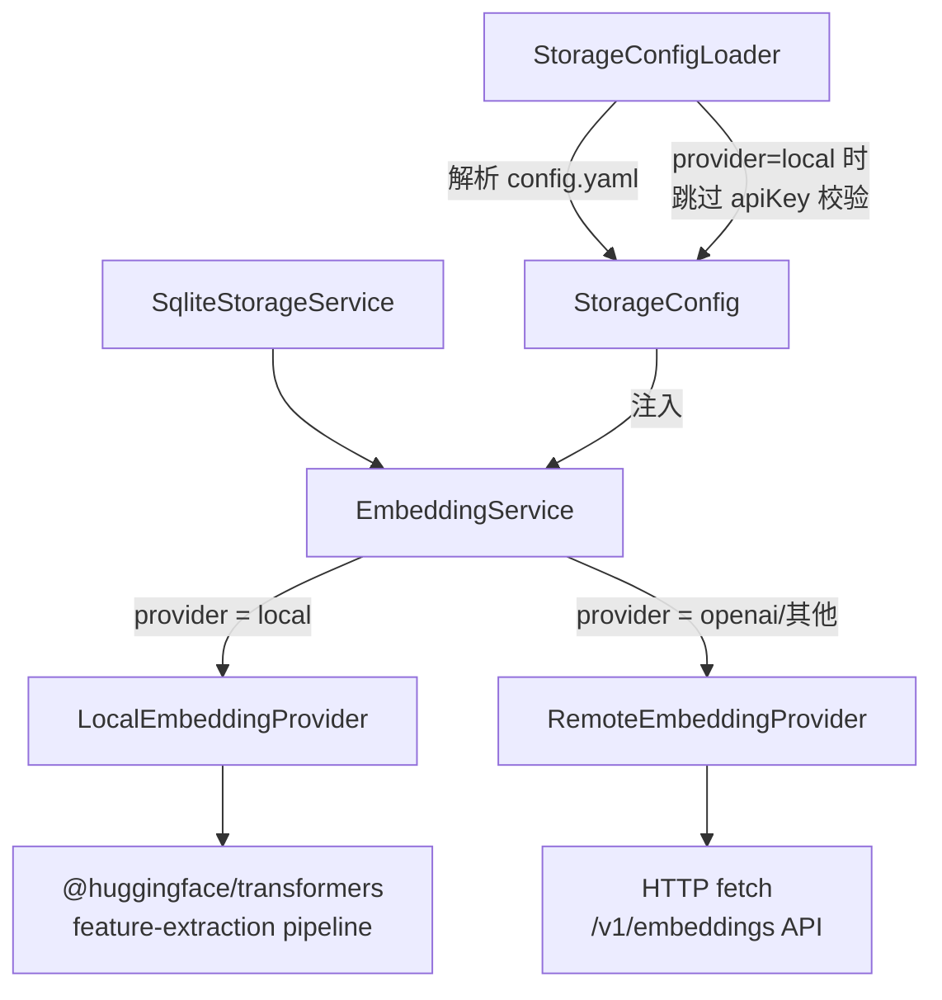
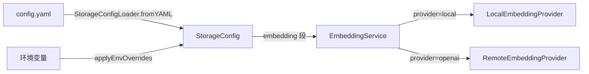

# 设计文档：本地 Embedding 推理

## 概述

本设计将 `@winches/storage` 包中的 `EmbeddingService` 从纯远程 OpenAI API 调用模式改造为支持本地 ONNX 模型推理的双模式架构。当 `embedding.provider` 配置为 `"local"` 时，使用 `@huggingface/transformers` 库在 Node.js 进程内加载并运行 embedding 模型；当配置为 `"openai"` 等其他值时，保持现有的远程 HTTP API 调用行为不变。

核心设计决策：
- 采用策略模式（Strategy Pattern），将本地推理和远程 API 调用封装为两个独立的内部实现，由 `EmbeddingService` 根据 provider 配置分发
- `StorageConfig` 类型中 `apiKey` 改为可选字段，`StorageConfigLoader` 对 `"local"` provider 放宽校验
- pipeline 实例懒加载 + 单例复用，避免重复初始化开销

## 架构



整体流程：
1. `StorageConfigLoader` 从 YAML 加载配置，根据 provider 值决定校验策略
2. `EmbeddingService` 构造时根据 `config.provider` 选择内部实现
3. 调用 `embed(text)` 时委托给对应的 provider 实现
4. `SqliteStorageService` 无需感知底层变化，继续通过 `EmbeddingService.embed()` 获取向量

## 组件与接口

### 1. EmbeddingProvider 接口（内部）

定义统一的 embedding 提供者契约：

```typescript
/** 内部接口，不导出 */
interface EmbeddingProvider {
  embed(text: string): Promise<number[]>;
}
```

### 2. LocalEmbeddingProvider（新增）

负责本地 ONNX 模型推理：

```typescript
class LocalEmbeddingProvider implements EmbeddingProvider {
  private readonly model: string;
  private pipelineInstance: FeatureExtractionPipeline | null = null;
  private pipelinePromise: Promise<FeatureExtractionPipeline> | null = null;

  constructor(model: string);
  
  /** 懒加载 pipeline，首次调用时初始化 */
  private async getPipeline(): Promise<FeatureExtractionPipeline>;
  
  /** 计算 embedding 向量 */
  async embed(text: string): Promise<number[]>;
}
```

关键行为：
- `getPipeline()` 使用 `@huggingface/transformers` 的 `pipeline("feature-extraction", model)` 创建实例
- pipeline 实例通过 `pipelinePromise` 保证并发安全的单次初始化
- 如果初始化失败，将 `pipelinePromise` 重置为 `null`，下次调用重新尝试
- 空字符串输入返回与模型维度一致的全零向量（`all-MiniLM-L6-v2` 为 384 维）

### 3. RemoteEmbeddingProvider（重构自现有代码）

将现有 `EmbeddingService` 的 HTTP 调用逻辑提取为独立类：

```typescript
class RemoteEmbeddingProvider implements EmbeddingProvider {
  private readonly model: string;
  private readonly apiKey: string;
  private readonly baseUrl: string;

  constructor(config: { model: string; apiKey: string; baseUrl?: string; provider: string });
  async embed(text: string): Promise<number[]>;
}
```

逻辑与现有 `EmbeddingService.embed()` 完全一致，仅做代码搬迁。

### 4. EmbeddingService（重构）

改为门面类，根据 provider 委托给具体实现：

```typescript
export class EmbeddingService {
  private readonly provider: EmbeddingProvider;

  constructor(config: StorageConfig["embedding"]) {
    if (config.provider === "local") {
      this.provider = new LocalEmbeddingProvider(config.model);
    } else {
      this.provider = new RemoteEmbeddingProvider(config);
    }
  }

  async embed(text: string): Promise<number[]> {
    return this.provider.embed(text);
  }
}
```

公共接口 `embed(text: string): Promise<number[]>` 保持不变，`SqliteStorageService` 无需任何修改。

### 5. StorageConfigLoader（修改）

`validate()` 方法根据 provider 值决定校验逻辑：

```typescript
static validate(config: Partial<StorageConfig>): asserts config is StorageConfig {
  // ... dbPath、embedding、provider、model 校验不变 ...
  
  if (config.embedding.provider !== "local" && !config.embedding.apiKey) {
    throw new ConfigError(
      "Missing required config field: embedding.apiKey",
      "embedding.apiKey",
    );
  }
}
```

### 6. StorageConfig 类型（修改）

```typescript
export interface StorageConfig {
  dbPath: string;
  embedding: {
    provider: string;
    model: string;
    apiKey?: string;   // 改为可选，仅非 local provider 时必填
    baseUrl?: string;
  };
}
```

## 数据模型

### 配置数据流



### config.yaml 本地模式示例

```yaml
embedding:
  provider: local
  model: Xenova/all-MiniLM-L6-v2
```

### config.yaml 远程模式示例（保持不变）

```yaml
embedding:
  provider: openai
  model: text-embedding-3-small
  apiKey: ${AGENT_API_KEY}
```

### 数据库存储格式

`memories` 表的 `vector` 列存储格式不变，仍为 JSON 序列化的 `number[]`。本地模型（`all-MiniLM-L6-v2`）输出 384 维向量，与远程模型维度可能不同，但存储格式一致。

> 注意：切换 provider 后，已有向量与新向量维度不同，余弦相似度计算将不可靠。这是预期行为，用户切换 provider 时应清理旧数据或重新生成向量。

### 依赖变更

`@winches/storage` 的 `package.json` 变更：

| 操作 | 包名 | 说明 |
|------|------|------|
| 新增 | `@huggingface/transformers` | 本地 ONNX 推理 |
| 保留 | `@winches/ai` | `Message` 类型仍被 `storage.ts` 和 `types.ts` 引用 |

`@winches/ai` 不能移除，因为 `StorageService` 接口和 `SqliteStorageService` 都依赖 `Message` 类型。


## 正确性属性

*属性（Property）是在系统所有有效执行中都应成立的特征或行为——本质上是对系统应做什么的形式化陈述。属性是人类可读规格说明与机器可验证正确性保证之间的桥梁。*

### 属性 1：Embed 输出维度一致性

*对于任意*非空文本字符串，调用本地 `EmbeddingService.embed(text)` 返回的结果应为 `number[]`，且长度等于模型的输出维度（`all-MiniLM-L6-v2` 为 384）。

**验证需求：1.1**

### 属性 2：Pipeline 单例复用

*对于任意*多次连续调用 `embed()`，`LocalEmbeddingProvider` 内部使用的 pipeline 实例应始终是同一个引用（即只初始化一次）。

**验证需求：1.4**

### 属性 3：Local Provider 配置仅需 provider 和 model

*对于任意*配置对象，当 `embedding.provider` 为 `"local"` 时，只要提供了 `provider` 和 `model` 字段，`StorageConfigLoader.validate()` 就应通过校验，无论 `apiKey` 和 `baseUrl` 是否存在。

**验证需求：3.1, 3.2, 3.4**

### 属性 4：非 Local Provider 必须提供 apiKey

*对于任意*配置对象，当 `embedding.provider` 不为 `"local"` 时，如果缺少 `apiKey` 字段，`StorageConfigLoader.validate()` 应抛出 `ConfigError`。

**验证需求：3.5**

### 属性 5：向量存储 Round-Trip

*对于任意* embedding 向量（`number[]`），经过 JSON 序列化存入 `memories` 表的 `vector` 列后，再反序列化读取，应得到与原始向量数值相等的数组。

**验证需求：4.4**

### 属性 6：错误统一包装为 EmbeddingError

*对于任意*在模型加载或推理过程中抛出的底层错误，`EmbeddingService` 应将其包装为 `EmbeddingError`，且 `cause` 属性指向原始错误对象。

**验证需求：6.1, 6.2**

### 属性 7：Pipeline 初始化失败后允许重试

*对于任意*导致 pipeline 初始化失败的错误，下一次调用 `embed()` 时应重新尝试初始化 pipeline，而非返回缓存的失败状态。

**验证需求：6.3**

## 错误处理

### 错误分类与处理策略

| 错误场景 | 错误类型 | 处理方式 |
|----------|----------|----------|
| 模型下载失败（无网络且无缓存） | `EmbeddingError` | 包装原始错误为 cause，重置 pipelinePromise 允许重试 |
| 推理过程中内存不足或模型错误 | `EmbeddingError` | 包装原始错误为 cause |
| 远程 API 返回非 200 状态码 | `EmbeddingError` | 保持现有行为，包含 HTTP 状态码和响应体 |
| 远程 API 网络不可达 | `EmbeddingError` | 保持现有行为，包装 fetch 错误 |
| 配置缺少必填字段 | `ConfigError` | 保持现有行为，指明缺失字段 |

### Pipeline 初始化失败重试机制

```typescript
private async getPipeline(): Promise<FeatureExtractionPipeline> {
  if (this.pipelineInstance) return this.pipelineInstance;
  
  if (!this.pipelinePromise) {
    this.pipelinePromise = pipeline("feature-extraction", this.model)
      .then((p) => {
        this.pipelineInstance = p;
        return p;
      })
      .catch((err) => {
        this.pipelinePromise = null;  // 重置，允许下次重试
        throw new EmbeddingError("Failed to initialize embedding pipeline", { cause: err });
      });
  }
  
  return this.pipelinePromise;
}
```

关键点：
- `pipelinePromise` 在失败时重置为 `null`，确保下次调用重新尝试
- `pipelineInstance` 仅在成功时赋值，作为快速路径
- 并发调用共享同一个 Promise，避免重复初始化

## 测试策略

### 双重测试方法

本特性采用单元测试 + 属性测试的双重策略：

- **单元测试**：验证具体示例、边界情况和错误条件
- **属性测试**：验证跨所有输入的通用属性

### 属性测试

使用 `fast-check`（项目已有依赖）作为属性测试库，每个属性测试至少运行 100 次迭代。

每个属性测试必须通过注释引用设计文档中的属性编号：

```typescript
// Feature: local-embedding, Property 1: Embed 输出维度一致性
```

属性测试覆盖：

| 属性 | 测试描述 | 生成器 |
|------|----------|--------|
| 属性 1 | 随机非空字符串 → embed 返回 384 维 number[] | `fc.string({ minLength: 1 })` |
| 属性 2 | 随机次数调用 embed → pipeline 引用不变 | `fc.integer({ min: 2, max: 10 })` |
| 属性 3 | 随机 model 名 + provider="local" → validate 通过 | `fc.record({ provider: fc.constant("local"), model: fc.string({ minLength: 1 }) })` |
| 属性 4 | 随机非 local provider + 无 apiKey → validate 抛出 ConfigError | `fc.string().filter(s => s !== "local" && s.length > 0)` |
| 属性 5 | 随机 number[] → JSON 序列化/反序列化 round-trip | `fc.array(fc.float({ noNaN: true }))` |
| 属性 6 | 随机 Error → 包装为 EmbeddingError 且 cause 正确 | `fc.string()` 构造 Error |
| 属性 7 | 首次失败 + 第二次成功 → 验证重试行为 | 模拟 pipeline 工厂函数 |

### 单元测试

单元测试覆盖以下具体场景：

- 空字符串输入返回 384 维全零向量（边界情况，需求 1.5）
- 默认模型为 `Xenova/all-MiniLM-L6-v2`（需求 1.2）
- 构造后未调用 embed 时 pipeline 未初始化（需求 1.3）
- 模型下载失败时抛出 EmbeddingError（需求 2.4）
- provider="openai" 时构造 RemoteEmbeddingProvider（需求 4.1）
- provider="local" 时构造 LocalEmbeddingProvider

### 测试文件组织

```
packages/storage/src/__tests__/
  embedding.test.ts          # 单元测试
  embedding.property.test.ts # 属性测试
  config.test.ts             # StorageConfigLoader 单元测试 + 属性测试
```

### 注意事项

- 属性测试中的本地推理测试需要 mock `@huggingface/transformers` 的 `pipeline` 函数，避免实际加载模型
- 属性 5（向量 round-trip）是纯数据测试，不需要 mock
- 属性 3 和 4 测试 `StorageConfigLoader.validate()`，是纯逻辑测试
