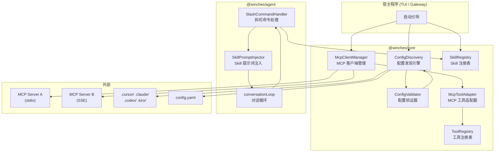
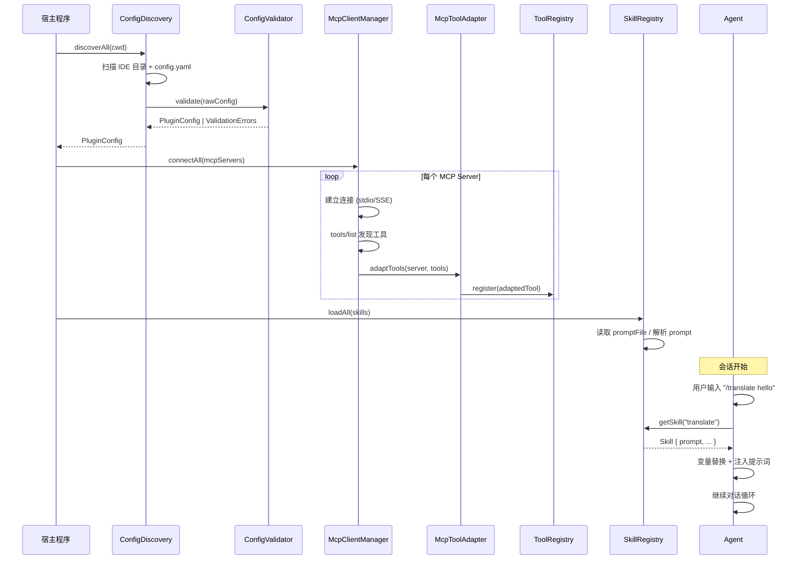

# 设计文档：MCP/Skills 集成

## 概述

本设计为 winches-agent 新增 MCP 服务器和 Skills 插件集成能力。核心思路是在 `@winches/core` 包中新增一个 `plugin` 模块，负责配置发现、MCP 客户端管理、工具适配和 Skill 注册；在 `@winches/agent` 包中扩展对话循环以支持 Slash Command 和 Skill 提示词注入。

设计遵循项目现有的嵌入式库模式：宿主程序（TUI/Gateway）在启动时调用插件初始化函数，将 MCP 工具注入到 ToolRegistry，将 Skill 注册到 SkillRegistry，然后将这些实例传递给 Agent。

### 设计决策

1. **新增模块而非新包**：MCP/Skills 功能放在 `@winches/core` 包的 `plugin/` 子目录中，因为它本质上是工具注册表的扩展，不需要独立的包。Slash Command 处理逻辑放在 `@winches/agent` 中，因为它是对话循环的扩展。
2. **使用 `@modelcontextprotocol/sdk`**：MCP 协议实现使用官方 TypeScript SDK，避免重复造轮子。
3. **配置发现与连接管理分离**：ConfigDiscovery 只负责扫描和合并配置，McpClientManager 负责连接生命周期管理，职责清晰。
4. **Skill 作为提示词注入而非工具**：Skill 不注册为 Tool，而是通过 Slash Command 触发后将提示词注入到对话上下文中，这更符合 Skill 的语义（预定义提示词模板）。

## 架构

### 整体架构图



### 数据流



## 组件与接口

### 1. ConfigDiscovery — 配置发现引擎

位置：`packages/core/src/plugin/config-discovery.ts`

职责：按优先级扫描多个 IDE 配置目录和 config.yaml，合并 MCP 和 Skills 配置。

```typescript
interface ConfigDiscoveryOptions {
  /** 项目根目录，默认 process.cwd() */
  projectRoot?: string;
  /** 用户主目录，默认 os.homedir() */
  homeDir?: string;
  /** config.yaml 路径，可选 */
  configYamlPath?: string;
}

/** 扫描并合并所有配置源，返回最终的 PluginConfig */
function discoverPluginConfig(options?: ConfigDiscoveryOptions): Promise<PluginConfig>;
```

扫描顺序（优先级从高到低）：
1. `{projectRoot}/.cursor/`
2. `{projectRoot}/.claude/`
3. `{projectRoot}/.codex/`
4. `{projectRoot}/.kiro/`
5. `{homeDir}/.cursor/`
6. `{homeDir}/.claude/`
7. `{homeDir}/.codex/`
8. `{homeDir}/.kiro/`
9. `config.yaml`（最低优先级）

合并规则：同名 MCP Server 或 Skill，高优先级覆盖低优先级。同一 IDE 在项目本地和全局同时存在时，项目本地优先，忽略该 IDE 的全局配置。

### 2. ConfigValidator — 配置验证器

位置：`packages/core/src/plugin/config-validator.ts`

职责：验证原始配置结构，收集所有错误后批量返回。

```typescript
interface ValidationError {
  path: string;       // 错误位置，如 "mcpServers[0].transport"
  message: string;    // 描述性错误信息
  source: string;     // 配置来源路径
}

/** 验证原始配置，返回错误列表（空数组表示通过） */
function validatePluginConfig(raw: unknown, source: string): ValidationError[];
```

验证规则：
- MCP Server：必须有 `name`、`transport`；stdio 必须有 `command`；sse 必须有 `url`
- Skill：`name` 仅允许 `[a-z0-9-]`；`prompt` 和 `promptFile` 不可同时存在；`promptFile` 引用的文件必须存在
- 所有错误收集完毕后一次性返回

### 3. McpClientManager — MCP 客户端管理器

位置：`packages/core/src/plugin/mcp-client-manager.ts`

职责：管理所有 MCP Server 的连接生命周期。

```typescript
interface McpServerStatus {
  name: string;
  status: "connected" | "failed" | "disconnected";
  toolCount: number;
  error?: string;
  source: string;  // 配置来源
}

class McpClientManager {
  /** 根据配置连接所有 MCP Server，将工具注入 registry */
  async connectAll(servers: McpServerConfig[], registry: ToolRegistry): Promise<void>;

  /** 获取所有 MCP Server 的状态 */
  getStatus(): McpServerStatus[];

  /** 关闭所有连接 */
  async disconnectAll(): Promise<void>;
}
```

连接策略：
- 逐一连接，单个失败不影响其余
- stdio 传输：通过 `@modelcontextprotocol/sdk` 的 `StdioClientTransport` 启动子进程
- SSE 传输：通过 `@modelcontextprotocol/sdk` 的 `SSEClientTransport` 建立 HTTP 连接
- 连接成功后调用 `tools/list` 发现工具

### 4. McpToolAdapter — MCP 工具适配器

位置：`packages/core/src/plugin/mcp-tool-adapter.ts`

职责：将 MCP Server 暴露的工具转换为 `@winches/core` Tool 接口。

```typescript
/** 将 MCP 工具列表转换为 @winches/core Tool 数组 */
function adaptMcpTools(
  serverName: string,
  mcpTools: McpTool[],
  callTool: (name: string, args: unknown) => Promise<McpToolResult>,
): Tool[];
```

命名规则：`mcp.{serverName}.{toolName}`
- 所有 MCP 工具的 `dangerLevel` 默认为 `safe`
- `execute` 方法通过 MCP Client 转发调用请求
- MCP Server 返回错误时，转换为 `{ success: false, error: string }`

### 5. SkillRegistry — Skill 注册表

位置：`packages/core/src/plugin/skill-registry.ts`

职责：管理所有已加载的 Skill，提供查找和模板变量替换功能。

```typescript
class SkillRegistry {
  /** 批量加载 Skill 定义 */
  async loadAll(skills: SkillConfig[]): Promise<void>;

  /** 按名称查找 Skill */
  get(name: string): Skill | undefined;

  /** 列出所有已注册的 Skill */
  list(): Skill[];

  /** 渲染 Skill 提示词，替换模板变量 */
  renderPrompt(name: string, variables?: Record<string, string>): string | undefined;
}
```

模板变量替换：
- `{{cwd}}` → `process.cwd()`
- `{{os}}` → `process.platform`
- `{{date}}` → 当前日期 ISO 字符串
- `{{input}}` → Slash Command 后的额外文本
- 未定义变量保留原始占位符，记录 debug 日志

### 6. SlashCommandHandler — 斜杠命令处理

位置：`packages/agent/src/slash-commands.ts`

职责：解析和处理 Slash Command，包括 Skill 调用和状态查询。

```typescript
interface SlashCommandResult {
  handled: boolean;
  /** 需要注入的 system 消息（Skill 提示词） */
  systemMessage?: string;
  /** 需要作为用户消息发送的文本 */
  userMessage?: string;
  /** 直接返回给用户的响应（如 /mcp-status、/skills） */
  directResponse?: string;
}

/** 获取所有可用的 Slash Command 补全项（用于输入 / 时的下拉提示） */
interface SlashCommandCompletion {
  command: string;      // 命令名称，如 "translate"
  description: string;  // 命令描述
  type: "skill" | "builtin";  // 来源类型
}

function handleSlashCommand(
  input: string,
  skillRegistry: SkillRegistry,
  mcpClientManager: McpClientManager,
): SlashCommandResult;

/** 返回所有可用命令的补全列表，供宿主程序实现下拉提示 */
function getSlashCommandCompletions(
  skillRegistry: SkillRegistry,
): SlashCommandCompletion[];
```

支持的命令：
- `/skill-name [args]` — 调用已注册的 Skill
- `/mcp-status` — 显示 MCP Server 连接状态
- `/skills` — 列出所有已注册 Skill 的名称、描述和配置来源（同时作为帮助列表）

## 数据模型

### 配置类型

```typescript
/** IDE 类型标识 */
type IdeType = "cursor" | "claude" | "codex" | "kiro";

/** 配置来源 */
interface ConfigSource {
  ideType: IdeType | "config-yaml";
  path: string;
  scope: "project" | "global" | "yaml";
}

/** MCP Server 配置 */
interface McpServerConfig {
  name: string;
  transport: "stdio" | "sse";
  command?: string;
  args?: string[];
  env?: Record<string, string>;
  url?: string;
  source: ConfigSource;
}

/** Skill 配置 */
interface SkillConfig {
  name: string;
  description: string;
  prompt?: string;
  promptFile?: string;
  source: ConfigSource;
}

/** 合并后的最终插件配置 */
interface PluginConfig {
  mcpServers: McpServerConfig[];
  skills: SkillConfig[];
  /** 配置来源摘要，用于日志 */
  sourceSummary: string[];
}
```

### 运行时类型

```typescript
/** 已加载的 Skill 实例 */
interface Skill {
  name: string;
  description: string;
  prompt: string;  // 已解析的完整提示词内容
  source: ConfigSource;
}

/** MCP Server 连接状态 */
interface McpServerStatus {
  name: string;
  status: "connected" | "failed" | "disconnected";
  toolCount: number;
  error?: string;
  source: ConfigSource;
}
```

### AgentConfig 扩展

```typescript
/** 扩展后的 Agent 构造配置 */
interface AgentConfig {
  // ... 现有字段
  provider: LLMProvider;
  storage: StorageService;
  registry: ToolRegistry;
  sessionId: string;
  systemPrompt?: string;
  maxIterations?: number;
  // 新增字段
  skillRegistry?: SkillRegistry;
  mcpClientManager?: McpClientManager;
}
```

### IDE 配置文件格式

各 IDE 目录下的 `mcp.json` 格式：

```json
{
  "mcpServers": {
    "server-name": {
      "transport": "stdio",
      "command": "npx",
      "args": ["-y", "@some/mcp-server"],
      "env": { "API_KEY": "${MY_API_KEY}" }
    }
  }
}
```

Skills 目录结构（如 `.cursor/skills/translate.md`）：

```markdown
---
name: translate
description: 翻译文本到指定语言
---
你是一个翻译助手。请将以下内容翻译为目标语言。

当前工作目录：{{cwd}}
用户输入：{{input}}
```


## 正确性属性

*正确性属性是一种在系统所有有效执行中都应成立的特征或行为——本质上是对系统应做什么的形式化陈述。属性是人类可读规范与机器可验证正确性保证之间的桥梁。*

### Property 1: 配置合并优先级

*For any* 一组来自不同配置源（项目本地 IDE 目录、用户全局 IDE 目录、config.yaml）的 MCP Server 或 Skill 配置，如果存在同名条目，合并结果中该名称应仅保留来自最高优先级源的配置。优先级顺序为：项目本地 `.cursor` > `.claude` > `.codex` > `.kiro` > 全局 `.cursor` > `.claude` > `.codex` > `.kiro` > `config.yaml`。同一 IDE 类型在项目本地存在时，该 IDE 的全局配置应被完全忽略。

**Validates: Requirements 1.1, 1.2, 1.3, 1.5, 1.6, 1.8, 2.6**

### Property 2: MCP Server 配置验证与描述性错误

*For any* MCP Server 配置条目，如果缺少 `name` 或 `transport` 必填字段，或 stdio 类型缺少 `command`，或 sse 类型缺少 `url`，验证器应返回包含缺失字段名称、服务器名称和配置来源路径的错误信息。

**Validates: Requirements 2.2, 2.3, 2.4, 8.2**

### Property 3: 环境变量替换

*For any* 包含 `${VAR_NAME}` 占位符的配置字符串，如果对应的环境变量已设置，替换后的字符串应包含该环境变量的值且不再包含 `${VAR_NAME}` 占位符。

**Validates: Requirements 2.5**

### Property 4: MCP 工具适配不变量

*For any* MCP Server 名称和该 Server 暴露的工具列表，适配后的每个 Tool 对象应满足：名称格式为 `mcp.{serverName}.{toolName}`，`dangerLevel` 为 `safe`，且 `description` 和 `parameters` 与原始 MCP 工具定义一致。

**Validates: Requirements 4.1, 4.2, 4.3, 4.6**

### Property 5: MCP 工具调用转发与错误处理

*For any* MCP 工具调用请求，适配器应将参数原样转发给对应的 MCP Server。如果 MCP Server 返回成功结果，适配器应返回 `{ success: true, data: ... }`；如果 MCP Server 返回错误，适配器应返回 `{ success: false, error: string }` 且 error 包含 MCP Server 的错误信息。

**Validates: Requirements 4.4, 4.5**

### Property 6: Skill 名称格式验证

*For any* Skill 配置的 `name` 字段，如果包含大写字母、空格或 `[a-z0-9-]` 以外的字符，验证器应返回包含非法名称和允许字符规则的错误信息。

**Validates: Requirements 5.2, 8.3**

### Property 7: Skill prompt/promptFile 互斥验证

*For any* Skill 配置同时提供了 `prompt` 和 `promptFile` 字段，验证器应返回描述性错误指出两者不可同时使用。

**Validates: Requirements 5.4**

### Property 8: 重复 Skill 名称检测

*For any* 配置中包含两个或多个相同 `name` 的 Skill 定义，验证器应返回包含重复名称的描述性错误。

**Validates: Requirements 5.5**

### Property 9: Slash Command 识别与 Skill 调用

*For any* 以 `/` 开头的用户输入，如果 `/` 后的命令名匹配已注册的 Skill，处理结果应包含该 Skill 的提示词作为 systemMessage；如果命令后跟随额外文本，该文本应作为 userMessage 返回。对于不以 `/` 开头的输入，处理结果应标记为未处理（`handled: false`）。

**Validates: Requirements 6.1, 6.2, 6.3**

### Property 10: /skills 列出所有已注册 Skill

*For any* 一组已注册的 Skill，当用户输入 `/skills` 时，返回的响应应包含每个 Skill 的名称、描述和配置来源。

**Validates: Requirements 6.4, 9.2**

### Property 11: 已定义模板变量替换

*For any* 包含 `{{variableName}}` 占位符的提示词模板，如果变量名对应一个已定义的值（包括内置变量 `{{cwd}}`、`{{os}}`、`{{date}}` 和用户输入 `{{input}}`），渲染后的提示词应将占位符替换为对应的值。

**Validates: Requirements 7.1, 7.2, 7.3**

### Property 12: 未定义模板变量保留

*For any* 包含 `{{unknownVar}}` 占位符的提示词模板，如果该变量名未在已定义变量中，渲染后的提示词应保留原始 `{{unknownVar}}` 文本不做替换。

**Validates: Requirements 7.4**

### Property 13: 批量错误报告

*For any* 包含 N 个验证错误的配置（N ≥ 2），验证器应一次性返回包含所有 N 个错误的列表，而非在遇到第一个错误时停止。

**Validates: Requirements 8.5**

### Property 14: /mcp-status 输出完整性

*For any* 一组已配置的 MCP Server（包含已连接、连接失败和未连接状态），当用户输入 `/mcp-status` 时，返回的响应应包含每个 Server 的名称、连接状态、工具数量和配置来源。

**Validates: Requirements 9.1**

### Property 15: Slash Command 补全列表完整性

*For any* 一组已注册的 Skill 和内置命令（/mcp-status、/skills），`getSlashCommandCompletions` 返回的列表应包含所有已注册 Skill（type 为 "skill"）和所有内置命令（type 为 "builtin"），每项包含命令名称和描述。

**Validates: Requirements 6.6**

## 错误处理

### 配置发现阶段

| 错误场景 | 处理方式 |
|---------|---------|
| IDE 配置目录不存在 | 静默跳过，继续扫描下一个目录 |
| 配置文件 JSON 解析失败 | 记录 warn 日志（含文件路径和错误原因），跳过该文件 |
| config.yaml 不存在 | 静默跳过，不影响 IDE 目录配置 |
| 所有路径均无配置 | 返回空 PluginConfig，Agent 正常启动（需求 1.7） |

### 配置验证阶段

| 错误场景 | 处理方式 |
|---------|---------|
| MCP Server 缺少必填字段 | 收集 ValidationError，包含字段名、服务器名、来源路径 |
| Skill name 含非法字符 | 收集 ValidationError，包含非法名称和允许字符规则 |
| prompt 和 promptFile 同时存在 | 收集 ValidationError |
| promptFile 文件不存在 | 收集 ValidationError，包含文件路径 |
| 重复 Skill name | 收集 ValidationError，包含重复名称 |
| 验证完成 | 一次性返回所有 ValidationError 列表 |

宿主程序收到非空错误列表时，应将所有错误输出到 stderr 并退出（或降级运行）。

### MCP 连接阶段

| 错误场景 | 处理方式 |
|---------|---------|
| MCP Server 连接超时 | 记录 warn 日志，标记状态为 `failed`，继续连接其余 Server |
| MCP Server 进程崩溃 | 记录 warn 日志，标记状态为 `failed` |
| tools/list 调用失败 | 记录 warn 日志，该 Server 不注入任何工具 |
| 所有 Server 连接失败 | Agent 正常启动，仅使用内置工具 |

### MCP 工具调用阶段

| 错误场景 | 处理方式 |
|---------|---------|
| MCP Server 返回错误 | 返回 `{ success: false, error: string }`，error 包含 Server 错误信息 |
| MCP Server 连接断开 | 返回 `{ success: false, error: "MCP server disconnected" }` |
| 调用超时 | 返回 `{ success: false, error: "MCP tool call timed out" }` |

### Skill 加载阶段

| 错误场景 | 处理方式 |
|---------|---------|
| promptFile 读取失败 | 记录 warn 日志，跳过该 Skill |
| Skill Markdown frontmatter 解析失败 | 记录 warn 日志，跳过该文件 |

### Slash Command 阶段

| 错误场景 | 处理方式 |
|---------|---------|
| 命令未匹配任何 Skill 或内置命令 | 返回包含可用 Skill 和内置命令列表的提示信息 |
| Skill 提示词渲染失败 | 返回错误提示，不中断会话 |

### 错误类定义

在 `@winches/core` 中新增：

```typescript
class PluginError extends CoreError { ... }
class PluginConfigValidationError extends PluginError {
  public readonly errors: ValidationError[];
}
class McpConnectionError extends PluginError {
  public readonly serverName: string;
}
```

## 测试策略

### 测试框架

- 单元测试：Vitest
- 属性测试：fast-check（项目已有依赖）
- 测试文件位置：`packages/core/src/__tests__/plugin/` 和 `packages/agent/src/__tests__/`

### 属性测试配置

- 每个属性测试最少运行 100 次迭代
- 每个属性测试必须通过注释引用设计文档中的属性编号
- 标签格式：`Feature: mcp-skills-integration, Property {number}: {property_text}`

### 单元测试覆盖

单元测试聚焦于具体示例、边界条件和集成点：

- **ConfigDiscovery**：空目录、单一来源、多来源合并的具体场景
- **ConfigValidator**：各种非法配置的具体错误消息验证
- **McpClientManager**：连接成功/失败的 mock 场景、disconnectAll 清理
- **McpToolAdapter**：具体工具调用的 mock 转发
- **SkillRegistry**：promptFile 加载、frontmatter 解析
- **SlashCommandHandler**：/mcp-status、/skills 的具体输出格式、自动补全列表生成
- **边界条件**：空配置启动（需求 1.7）、promptFile 不存在（需求 8.4）、未匹配命令（需求 6.4）

### 属性测试覆盖

每个正确性属性对应一个属性测试：

| 属性 | 测试文件 | 生成器策略 |
|------|---------|-----------|
| P1 配置合并优先级 | `config-discovery.test.ts` | 生成随机 MCP/Skill 名称和多个 ConfigSource，验证合并结果 |
| P2 MCP 配置验证 | `config-validator.test.ts` | 生成随机缺失字段的 MCP 配置，验证错误信息内容 |
| P3 环境变量替换 | `config-discovery.test.ts` | 生成随机变量名和值，验证替换结果 |
| P4 MCP 工具适配不变量 | `mcp-tool-adapter.test.ts` | 生成随机 server 名和工具定义，验证适配结果 |
| P5 MCP 工具调用转发 | `mcp-tool-adapter.test.ts` | 生成随机调用参数和 mock 响应，验证转发行为 |
| P6 Skill 名称验证 | `config-validator.test.ts` | 生成包含非法字符的随机字符串，验证拒绝 |
| P7 prompt/promptFile 互斥 | `config-validator.test.ts` | 生成同时包含两个字段的配置，验证错误 |
| P8 重复 Skill 名称 | `config-validator.test.ts` | 生成包含重复名称的 Skill 列表，验证错误 |
| P9 Slash Command 识别 | `slash-commands.test.ts` | 生成随机 Skill 名称和输入文本，验证解析结果 |
| P10 /skills 输出 | `slash-commands.test.ts` | 生成随机 Skill 集合，验证 /skills 包含所有名称、描述和来源 |
| P11 模板变量替换 | `skill-registry.test.ts` | 生成随机变量名和值，验证替换结果 |
| P12 未定义变量保留 | `skill-registry.test.ts` | 生成随机未定义变量名，验证保留原文 |
| P13 批量错误报告 | `config-validator.test.ts` | 生成包含 N 个错误的配置，验证返回 N 个错误 |
| P14 /mcp-status 输出 | `slash-commands.test.ts` | 生成随机 MCP 状态集合，验证输出完整性 |
| P15 补全列表完整性 | `slash-commands.test.ts` | 生成随机 Skill 集合，验证补全列表包含所有 Skill 和内置命令 |

### Mock 策略

- **MCP Client**：mock `@modelcontextprotocol/sdk` 的 Client 类，模拟 `connect`、`listTools`、`callTool` 方法
- **文件系统**：使用 `memfs` 或 Vitest 的 `vi.mock("node:fs")` mock 文件读取
- **环境变量**：在测试中临时设置 `process.env`，测试后恢复
- **ToolRegistry**：使用真实的 ToolRegistry 实例（轻量，无需 mock）
