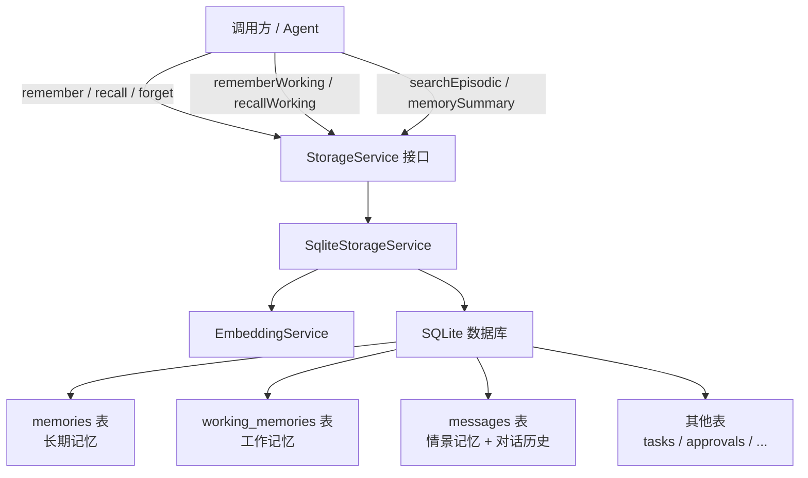

# 设计文档：memory-enhancement

## 概述

本设计为 `@winches/storage` 包的记忆子系统添加六项增强能力：**重要性字段**、**时间衰减**、**遗忘机制**、**工作记忆 / 长期记忆分层**、**情景记忆**、**记忆摘要**。

所有变更均在现有 SQLite 单文件架构内完成，通过新增迁移脚本扩展数据库 schema，通过可选参数扩展现有接口，保持向后兼容。

### 设计目标

- 现有 `remember()` / `recall()` 调用签名不变（新参数均为可选）
- 不引入外部数据库或向量数据库
- 所有破坏性操作（`forget()`）在单次事务中原子执行
- 使用 fast-check 进行属性测试

---

## 架构

### 整体分层



### 评分流水线（recall）

```mermaid
flowchart LR
    Q[查询文本] --> EMB[EmbeddingService.embed]
    EMB --> COS[余弦相似度]
    DB[memories 表] --> COS
    COS --> DECAY[× exp\(-λ × age_days\)]
    DECAY --> IMP[× \(1 + w × importance\)]
    IMP --> SORT[降序排列 → topK]
```

### 遗忘策略流程

```mermaid
flowchart TD
    F[forget\(strategy, options\)] --> V{参数校验}
    V -->|失败| E[InvalidForgetOptionsError]
    V -->|通过| TX[开启事务]
    TX --> S{strategy.type}
    S -->|importance| DI[DELETE WHERE importance < threshold]
    S -->|time| DT[DELETE WHERE created_at < now - olderThanMs]
    S -->|capacity| DC[保留 top-N，删除其余]
    DI --> COMMIT[提交事务，返回删除数]
    DT --> COMMIT
    DC --> COMMIT
```

---

## 组件与接口

### 新增 / 修改的类型（types.ts）

```typescript
/** 遗忘策略 */
export type ForgetStrategy =
  | { type: 'importance'; threshold: number }
  | { type: 'time'; olderThanMs: number }
  | { type: 'capacity'; maxCount: number };

/** recall() 选项 */
export interface RecallOptions {
  topK?: number;
  decayRate?: number;          // λ，默认 0.1
  importanceWeight?: number;   // w，默认 0.3
}

/** rememberWorking() 选项 */
export interface WorkingMemoryOptions {
  ttl?: number;        // 毫秒，默认 3_600_000（1h）
  capacity?: number;   // 每会话上限，默认 50
  importance?: number; // [0,1]，默认 0.5
}

/** 工作记忆条目 */
export interface WorkingMemory {
  id: string;
  sessionId: string;
  content: string;
  createdAt: Date;
  ttl: number;       // 毫秒
  importance: number;
}
```

### Memory 接口扩展

```typescript
export interface Memory {
  id: string;
  content: string;
  tags: string[];
  createdAt: Date;
  importance: number;  // 新增，[0,1]，默认 0.5
  vector?: number[];
}
```

### StorageService 接口扩展

```typescript
export interface StorageService {
  // 现有方法（签名不变）
  remember(content: string, tags?: string[], options?: RememberOptions): Promise<Memory>;
  recall(query: string, topK?: number, options?: RecallOptions): Promise<Memory[]>;

  // 新增方法
  forget(strategy: ForgetStrategy): Promise<number>;
  rememberWorking(content: string, sessionId: string, options?: WorkingMemoryOptions): Promise<WorkingMemory>;
  recallWorking(sessionId: string): Promise<WorkingMemory[]>;
  searchEpisodic(query: string, options?: EpisodicSearchOptions): Promise<EpisodicMemory[]>;
  memorySummary(): Promise<MemorySummary>;
}
```

> 注：`remember()` 第三个参数 `options?: RememberOptions`（含 `importance?: number`）为新增可选参数，不影响现有调用。

### 新增类型（types.ts）

```typescript
/** searchEpisodic() 选项 */
export interface EpisodicSearchOptions {
  topK?: number;       // 默认 5
  sessionId?: string;  // 限定会话
  role?: string;       // 限定角色（"user" | "assistant" | ...）
}

/** 情景记忆检索结果 */
export interface EpisodicMemory {
  id: string;
  sessionId: string;
  role: string;
  content: string;
  createdAt: Date;
  similarity: number;  // 余弦相似度，∈ [0, 1]
}

/** 记忆摘要 */
export interface MemorySummary {
  longTerm: {
    count: number;
    avgImportance: number;
  };
  working: {
    count: number;
    activeCount: number;  // created_at + ttl > now
  };
  episodic: {
    totalMessages: number;
    vectorizedCount: number;  // vector IS NOT NULL
  };
}
```

### 新增错误类型（errors.ts）

| 错误类 | code | 触发条件 |
|---|---|---|
| `InvalidImportanceError` | `INVALID_IMPORTANCE` | importance 不在 [0,1] |
| `InvalidDecayRateError` | `INVALID_DECAY_RATE` | decayRate < 0 |
| `InvalidForgetOptionsError` | `INVALID_FORGET_OPTIONS` | forget() 参数缺少必要字段 |

---

## 数据模型

### 迁移 004：memories 表添加 importance 列

```sql
-- 004_add_memory_importance.sql
ALTER TABLE memories ADD COLUMN importance REAL NOT NULL DEFAULT 0.5;
```

### 迁移 005：新增 working_memories 表

```sql
-- 005_add_working_memories.sql
CREATE TABLE IF NOT EXISTS working_memories (
  id         TEXT    PRIMARY KEY,
  session_id TEXT    NOT NULL,
  content    TEXT    NOT NULL,
  created_at INTEGER NOT NULL,  -- Unix timestamp (ms)
  ttl        INTEGER NOT NULL,  -- 毫秒
  importance REAL    NOT NULL DEFAULT 0.5
);

CREATE INDEX IF NOT EXISTS idx_working_memories_session
  ON working_memories (session_id, created_at);
```

### 迁移 006：messages 表添加 vector 列

```sql
-- 006_add_message_vectors.sql
ALTER TABLE messages ADD COLUMN vector TEXT;  -- JSON 序列化的 number[]，可为 NULL
```

### 综合评分公式

```
composite_score = semantic_similarity
                × exp(-λ × age_in_days)
                × (1 + w × importance)
```

其中：
- `semantic_similarity`：查询向量与记忆向量的余弦相似度，∈ [0, 1]
- `λ`（`decayRate`）：衰减率，默认 0.1
- `age_in_days`：记忆创建至今的天数，`(now - createdAt) / 86_400_000`
- `w`（`importanceWeight`）：重要性权重，默认 0.3
- `importance`：记忆重要性，∈ [0, 1]，默认 0.5

### capacity 策略的排序依据

`forget({ type: 'capacity', maxCount: n })` 保留分值最高的 n 条，分值计算使用简化公式（无需查询向量）：

```
retention_score = importance × exp(-0.1 × age_in_days)
```

---

## 正确性属性

*属性（Property）是在系统所有合法执行路径上都应成立的特征或行为——本质上是对系统应做什么的形式化陈述。属性是人类可读规范与机器可验证正确性保证之间的桥梁。*

### 属性 1：remember 重要性 round-trip

*对任意* 合法的 content 字符串和 importance 值（∈ [0,1]），调用 `remember(content, tags, { importance })` 后，返回的 `Memory` 对象的 `importance` 字段应等于传入值；若未传入 importance，则应等于默认值 `0.5`。

**验证需求：1.1、1.2、1.4**

---

### 属性 2：importance 越界抛出错误

*对任意* 小于 0 或大于 1 的 importance 值，调用 `remember()` 时系统应抛出 `InvalidImportanceError`，且不应有任何记忆被写入数据库。

**验证需求：1.3**

---

### 属性 3：综合评分排序正确性

*对任意* 两条语义内容相同（余弦相似度相等）的记忆，若其中一条的 `importance` 更高或 `createdAt` 更近，则 `recall()` 应将其排在更前面。完整公式为 `composite_score = semantic_similarity × exp(-λ × age_in_days) × (1 + w × importance)`。

**验证需求：1.5、2.1、2.2**

---

### 属性 4：自定义衰减率与重要性权重生效

*对任意* 合法的 `decayRate`（≥ 0）和 `importanceWeight`（≥ 0），通过 `options` 传入后，`recall()` 的排序结果应与使用该参数手动计算的综合评分一致。

**验证需求：2.3、2.4**

---

### 属性 5：decayRate 为负数时抛出错误

*对任意* 负数 `decayRate`，调用 `recall()` 时系统应抛出 `InvalidDecayRateError`。

**验证需求：2.5**

---

### 属性 6：forget(importance) 删除低重要性记忆

*对任意* 记忆集合和阈值 `t`（∈ [0,1]），调用 `forget({ type: 'importance', threshold: t })` 后，数据库中剩余的所有记忆的 `importance` 均应 ≥ `t`，且返回值等于实际删除的条数。

**验证需求：3.1、3.2**

---

### 属性 7：forget(time) 删除过期记忆

*对任意* 记忆集合和时间窗口 `d`（毫秒），调用 `forget({ type: 'time', olderThanMs: d })` 后，数据库中剩余的所有记忆的 `createdAt` 均应 ≥ `(now - d)`，且返回值等于实际删除的条数。

**验证需求：3.1、3.3**

---

### 属性 8：forget(capacity) 保留 top-N

*对任意* 记忆集合和容量上限 `n`，调用 `forget({ type: 'capacity', maxCount: n })` 后，数据库中剩余记忆条数应 ≤ `n`，且保留的记忆均为 `retention_score` 最高的 n 条。

**验证需求：3.1、3.4**

---

### 属性 9：forget() 参数缺失时抛出错误

*对任意* 缺少必要字段的 `ForgetStrategy` 对象（如 `importance` 策略缺少 `threshold`），调用 `forget()` 时系统应抛出 `InvalidForgetOptionsError`，且不应有任何记忆被删除。

**验证需求：3.5**

---

### 属性 10：工作记忆 round-trip（存取一致）

*对任意* content、sessionId 和合法的 WorkingMemoryOptions，调用 `rememberWorking()` 后立即调用 `recallWorking(sessionId)`，应能取回该条工作记忆，且所有字段（content、ttl、importance）与存入时一致。

**验证需求：4.1、4.2、4.5、4.6、4.8**

---

### 属性 11：recallWorking() 过滤过期条目

*对任意* 工作记忆集合，`recallWorking(sessionId)` 返回的所有条目均应满足 `createdAt + ttl > now`；已过期的条目不应出现在结果中。

**验证需求：4.3**

---

### 属性 12：工作记忆容量淘汰

*对任意* 会话，当该会话的工作记忆条数达到 `capacity` 上限后，再插入一条新记忆时，系统应自动删除 `createdAt` 最早的一条，使总数保持在 `capacity`。

**验证需求：4.4、4.7**

---

### 属性 13：recall() 与 recallWorking() 结果隔离

*对任意* 同时包含长期记忆和工作记忆的数据库状态，`recall()` 的结果中不应包含任何工作记忆条目；`recallWorking()` 的结果中不应包含任何长期记忆条目。

**验证需求：4.9、4.10**

---

### 属性 14：searchEpisodic() 仅返回已向量化消息

*对任意* 包含已向量化和未向量化消息的数据库状态，`searchEpisodic(query)` 的结果中不应包含 `vector IS NULL` 的消息。

**验证需求：5.3**

---

### 属性 15：searchEpisodic() 会话过滤正确性

*对任意* 多会话消息集合，当通过 `options.sessionId` 指定会话时，`searchEpisodic()` 返回的所有条目的 `sessionId` 均应等于指定值。

**验证需求：5.5**

---

### 属性 16：memorySummary() 统计值与实际数据一致

*对任意* 数据库状态，`memorySummary()` 返回的 `longTerm.count` 应等于 `memories` 表的实际行数，`episodic.vectorizedCount` 应等于 `messages` 表中 `vector IS NOT NULL` 的行数，`working.activeCount` 应等于 `working_memories` 表中 `created_at + ttl > now` 的行数。

**验证需求：6.2、6.5**

---

## 错误处理

### 错误类型汇总

| 错误类 | code | 触发场景 | 行为 |
|---|---|---|---|
| `InvalidImportanceError` | `INVALID_IMPORTANCE` | importance ∉ [0,1] | 抛出，不写入数据库 |
| `InvalidDecayRateError` | `INVALID_DECAY_RATE` | decayRate < 0 | 抛出，不执行查询 |
| `InvalidForgetOptionsError` | `INVALID_FORGET_OPTIONS` | forget() 参数缺少必要字段 | 抛出，不执行删除 |
| `EmbeddingError`（已有） | `EMBEDDING_ERROR` | 向量生成失败 | 抛出，不写入数据库 |

### 边界值处理

- `importance = 0.0` 和 `importance = 1.0`：合法，正常处理
- `decayRate = 0`：合法，所有记忆无衰减（decay = 1）
- `forget({ type: 'capacity', maxCount: 0 })`：删除所有记忆
- `forget()` 在空表上调用：返回 0，不报错
- `recallWorking()` 在无记忆的会话上调用：返回空数组

---

## 测试策略

### 双轨测试方法

本功能同时采用**单元测试**和**属性测试**，两者互补：

- **单元测试**：验证具体示例、边界值和错误条件
- **属性测试**：通过随机输入验证普遍性质，覆盖单元测试难以穷举的输入空间

### 属性测试配置

- 使用 **fast-check** 库（TypeScript 生态主流 PBT 库）
- 每个属性测试最少运行 **100 次**迭代
- 每个属性测试必须通过注释引用设计文档中的属性编号
- 标签格式：`// Feature: memory-enhancement, Property N: <属性描述>`

### 属性测试列表

每个正确性属性对应一个属性测试：

| 测试 | 对应属性 | 测试模式 |
|---|---|---|
| remember 重要性 round-trip | 属性 1 | Round-trip |
| importance 越界抛出错误 | 属性 2 | 错误条件 |
| 综合评分排序正确性 | 属性 3 | 不变量 |
| 自定义参数生效 | 属性 4 | 参数化不变量 |
| decayRate 为负抛出错误 | 属性 5 | 错误条件 |
| forget(importance) 策略 | 属性 6 | 不变量 |
| forget(time) 策略 | 属性 7 | 不变量 |
| forget(capacity) 策略 | 属性 8 | 不变量 |
| forget() 参数缺失抛出错误 | 属性 9 | 错误条件 |
| 工作记忆 round-trip | 属性 10 | Round-trip |
| recallWorking() 过滤过期 | 属性 11 | 不变量 |
| 工作记忆容量淘汰 | 属性 12 | 不变量 |
| recall/recallWorking 隔离 | 属性 13 | 不变量 |

### 单元测试重点

- 迁移脚本正确执行（004、005）
- `importance = 0.0` / `1.0` 边界值
- `decayRate = 0` 时 decay = 1
- `forget({ type: 'capacity', maxCount: 0 })` 清空所有记忆
- 空表上调用 `forget()` 返回 0
- 空会话上调用 `recallWorking()` 返回 `[]`
- 默认 capacity = 50 的淘汰行为

### 测试文件结构

```
packages/storage/src/__tests__/
  memory-importance.test.ts      # 属性 1-2（重要性字段）
  memory-recall-scoring.test.ts  # 属性 3-5（评分与衰减）
  memory-forget.test.ts          # 属性 6-9（遗忘机制）
  working-memory.test.ts         # 属性 10-13（工作记忆）
  episodic-memory.test.ts        # 属性 14-15（情景记忆）
  memory-summary.test.ts         # 属性 16（记忆摘要）
```

