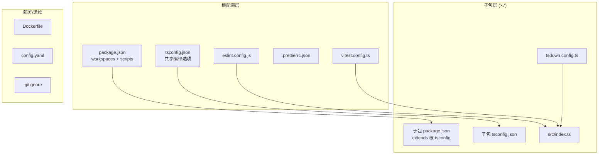

# 设计文档：Monorepo 脚手架初始化

## 概述

本设计文档描述 winches-agent 项目 Monorepo 脚手架的技术实现方案。脚手架负责生成完整的项目骨架，包括根配置文件、7 个子包目录结构、构建/测试/代码规范工具链配置、运行时配置模板和 Dockerfile。

脚手架产物是一组静态文件，不涉及运行时逻辑。核心设计决策围绕文件结构约定、配置一致性和工具链选型展开。

### 设计决策

1. **pnpm workspaces**：使用 pnpm 作为包管理器，通过 `pnpm-workspace.yaml` 配置 workspaces
2. **tsdown 构建**：基于 Rolldown 的 TypeScript 构建工具，速度快且配置简洁，适合 monorepo 场景
3. **ESLint flat config**：采用 ESLint v9+ 的 flat config 格式（`eslint.config.js`），更简洁且是官方推荐方向
4. **Vitest workspace 模式**：利用 Vitest 的 workspace 支持，从根目录统一运行所有子包测试
5. **配置继承模式**：子包通过 `extends` 继承根 tsconfig，通过根目录统一 ESLint/Prettier 配置，最小化重复

## 架构

### 文件结构总览

```
winches-agent/
├── packages/
│   ├── ai/
│   │   ├── src/
│   │   │   └── index.ts
│   │   ├── package.json
│   │   ├── tsconfig.json
│   │   ├── tsdown.config.ts
│   │   └── README.md
│   ├── core/          (同上结构)
│   ├── storage/       (同上结构)
│   ├── agent/         (同上结构)
│   ├── tui/           (同上结构)
│   ├── web-ui/        (同上结构)
│   └── gateway/       (同上结构)
├── package.json
├── pnpm-workspace.yaml
├── tsconfig.json
├── eslint.config.js
├── .prettierrc.json
├── .prettierignore
├── vitest.config.ts
├── config.yaml
├── Dockerfile
└── .gitignore
```

### 依赖关系图



## 组件与接口

本项目是纯文件生成型脚手架，不涉及运行时接口。以下按文件类别描述各组件的结构和约定。

### 1. 根 package.json

```jsonc
{
  "name": "winches-agent",
  "version": "0.0.1",
  "private": true,
  "type": "module",
  "engines": {
    "node": ">=22.0.0"
  },
  "scripts": {
    "build": "pnpm -r run build",
    "check": "eslint . && prettier --check . && tsc --noEmit",
    "test": "vitest run",
    "clean": "pnpm -r run clean"
  }
}
```

关键点：
- `private: true` 防止根包发布
- workspaces 通过 `pnpm-workspace.yaml` 配置
- `engines.node >= 22` 确保 ESM 和现代 API 支持
- `check` 脚本串联 eslint → prettier → tsc 三步检查

### 2. 共享 tsconfig.json

```jsonc
{
  "compilerOptions": {
    "strict": true,
    "target": "ES2022",
    "module": "NodeNext",
    "moduleResolution": "NodeNext",
    "declaration": true,
    "declarationMap": true,
    "sourceMap": true,
    "resolveJsonModule": true,
    "esModuleInterop": true,
    "skipLibCheck": true,
    "forceConsistentCasingInFileNames": true,
    "isolatedModules": true,
    "verbatimModuleSyntax": true
  }
}
```

### 3. 子包 package.json 模板

```jsonc
{
  "name": "@winches/<包名>",
  "version": "0.0.1",
  "private": true,
  "type": "module",
  "exports": {
    ".": {
      "types": "./dist/index.d.ts",
      "import": "./dist/index.js"
    }
  },
  "files": ["dist/"],
  "scripts": {
    "build": "tsdown",
    "clean": "rm -rf dist"
  }
}
```

### 4. 子包 tsconfig.json 模板

```jsonc
{
  "extends": "../../tsconfig.json",
  "compilerOptions": {
    "outDir": "./dist",
    "rootDir": "./src"
  },
  "include": ["src/**/*.ts"]
}
```

### 5. tsdown 构建配置模板

```typescript
import { defineConfig } from "tsdown";

export default defineConfig({
  entry: ["src/index.ts"],
  format: "esm",
  outDir: "dist",
  dts: true,
  clean: true,
});
```

### 6. ESLint 配置（flat config）

```javascript
// eslint.config.js
import eslint from "@eslint/js";
import tseslint from "typescript-eslint";
import eslintConfigPrettier from "eslint-config-prettier";

export default tseslint.config(
  eslint.configs.recommended,
  ...tseslint.configs.recommended,
  eslintConfigPrettier,
  {
    ignores: ["**/dist/", "**/coverage/", "**/node_modules/"],
  }
);
```

### 7. Prettier 配置

```jsonc
// .prettierrc.json
{
  "semi": true,
  "singleQuote": false,
  "tabWidth": 2,
  "trailingComma": "all",
  "printWidth": 100
}
```

```gitignore
# .prettierignore
dist/
coverage/
node_modules/
data/
```

### 8. Vitest 配置

```typescript
// vitest.config.ts
import { defineConfig } from "vitest/config";

export default defineConfig({
  test: {
    include: ["packages/**/src/**/*.{test,spec}.ts"],
    coverage: {
      reportsDirectory: "coverage",
    },
  },
});
```

### 9. config.yaml 模板

```yaml
# LLM Provider 配置
llm:
  provider: openai          # openai | anthropic | google | openai-compatible
  model: gpt-4o
  apiKey: ${AGENT_API_KEY}  # 支持环境变量引用
  baseUrl: null             # openai-compatible 时使用

# Embedding 配置
embedding:
  provider: openai
  model: text-embedding-3-small

# Telegram Bot 配置
telegram:
  botToken: ${AGENT_TELEGRAM_TOKEN}

# 审批超时配置
approval:
  timeout: 300              # 审批超时秒数，默认 5 分钟
  defaultAction: reject     # 超时后默认动作：reject | approve

# 存储路径配置
storage:
  dbPath: ./data/agent.db   # SQLite 数据库路径

# 日志级别配置
logging:
  level: info               # debug | info | warn | error
```

### 10. Dockerfile

```dockerfile
# === 构建阶段 ===
FROM node:22-slim AS builder
RUN corepack enable && corepack prepare pnpm@latest --activate
WORKDIR /app
COPY package.json pnpm-lock.yaml pnpm-workspace.yaml ./
COPY packages/ ./packages/
RUN pnpm install --frozen-lockfile
RUN pnpm run build

# === 运行阶段 ===
FROM node:22-slim AS runner
WORKDIR /app
ENV NODE_ENV=production
COPY --from=builder /app/package.json ./
COPY --from=builder /app/packages/*/dist/ ./packages/
COPY --from=builder /app/packages/*/package.json ./packages/
COPY --from=builder /app/node_modules/ ./node_modules/
COPY config.yaml ./
# 入口点由具体部署场景决定（gateway / web-ui）
# CMD ["node", "packages/gateway/dist/index.js"]
```

### 11. .gitignore

```gitignore
node_modules/
dist/
coverage/
.env
.env.*
data/
*.tsbuildinfo
```

## 数据模型

本项目为脚手架初始化，不涉及运行时数据模型。核心"数据"是各配置文件的结构约定：

### 子包元数据

| 包名 | scope 名 | 描述 |
|------|----------|------|
| ai | @winches/ai | 统一 LLM 抽象层 |
| core | @winches/core | 工具注册表 + 内置工具 |
| storage | @winches/storage | 持久化层 |
| agent | @winches/agent | Agent 运行时 |
| tui | @winches/tui | 终端聊天界面 |
| web-ui | @winches/web-ui | 管理/调试 Web 面板 |
| gateway | @winches/gateway | Telegram 接入 |

### 配置文件清单

| 文件 | 位置 | 用途 |
|------|------|------|
| package.json | 根目录 | workspaces 配置、全局 scripts |
| tsconfig.json | 根目录 | 共享 TypeScript 编译选项 |
| eslint.config.js | 根目录 | ESLint flat config |
| .prettierrc.json | 根目录 | Prettier 格式化规则 |
| .prettierignore | 根目录 | Prettier 忽略规则 |
| vitest.config.ts | 根目录 | Vitest 测试配置 |
| config.yaml | 根目录 | 运行时配置模板 |
| Dockerfile | 根目录 | 容器化构建配置 |
| .gitignore | 根目录 | Git 忽略规则 |
| package.json | packages/*/  | 子包配置 |
| tsconfig.json | packages/*/ | 子包 TS 配置（继承根） |
| tsdown.config.ts | packages/*/ | 子包构建配置 |
| README.md | packages/*/ | 子包说明文档 |
| index.ts | packages/*/src/ | 子包入口文件 |

## 正确性属性

*正确性属性是在系统所有有效执行中都应成立的特征或行为——本质上是关于系统应该做什么的形式化陈述。属性是人类可读规范与机器可验证正确性保证之间的桥梁。*

### Property 1: 子包目录结构完整性

*For any* 子包名称在定义列表 [ai, core, storage, agent, tui, web-ui, gateway] 中，`packages/<包名>/` 目录下必须存在以下文件：`package.json`、`tsconfig.json`、`tsdown.config.ts`、`README.md`、`src/index.ts`。

**Validates: Requirements 6.1, 6.2, 6.3, 6.4, 6.5, 3.1**

### Property 2: 子包 package.json 规范性

*For any* 子包，其 `package.json` 必须满足：`name` 字段格式为 `@winches/<包名>`，`type` 为 `"module"`，`exports` 字段的 `"."` 入口指向 `dist/` 目录下的文件，`files` 字段仅包含 `["dist/"]`。

**Validates: Requirements 6.2, 6.6, 6.7, 6.8**

### Property 3: 子包 tsconfig 继承正确性

*For any* 子包，其 `tsconfig.json` 必须通过 `extends` 字段引用根目录的 `tsconfig.json`（值为 `"../../tsconfig.json"`）。

**Validates: Requirements 2.6, 6.3**

### Property 4: 子包 tsdown 构建配置一致性

*For any* 子包，其 `tsdown.config.ts` 必须配置输出格式为 ESM（`format: "esm"`），输出目录为 `dist`（`outDir: "dist"`），且启用类型声明生成（`dts: true`）。

**Validates: Requirements 3.2, 3.3, 3.4**

### Property 5: 子包 README 包含包名

*For any* 子包，其 `README.md` 文件内容必须包含对应的 scope 包名 `@winches/<包名>`。

**Validates: Requirements 6.4**

## 错误处理

本项目为脚手架文件生成，不涉及运行时错误处理。实施过程中需注意：

| 场景 | 处理方式 |
|------|----------|
| 文件已存在 | 脚手架生成的文件应覆盖已有文件（首次初始化场景） |
| 目录不存在 | 递归创建所需目录结构 |
| JSON/YAML 语法错误 | 生成的配置文件必须通过对应格式的语法校验 |
| 路径引用错误 | 子包 tsconfig 的 extends 路径必须正确指向根配置 |

## 测试策略

### 双重测试方法

本项目采用单元测试 + 属性测试的双重策略：

- **单元测试（Unit Tests）**：验证具体的配置文件内容和特定示例
- **属性测试（Property-Based Tests）**：验证跨所有子包的通用属性

### 属性测试

使用 [fast-check](https://github.com/dubzzz/fast-check) 作为属性测试库（TypeScript 生态中最成熟的 PBT 库）。

每个属性测试配置：
- 最少 100 次迭代
- 每个测试通过注释引用设计文档中的属性编号
- 标签格式：**Feature: monorepo-scaffold, Property {number}: {property_text}**
- 每个正确性属性由一个属性测试实现

属性测试覆盖范围：
- Property 1：遍历所有子包名称，验证目录结构完整性
- Property 2：遍历所有子包，验证 package.json 字段规范性
- Property 3：遍历所有子包，验证 tsconfig.json 继承关系
- Property 4：遍历所有子包，验证 tsdown 构建配置一致性
- Property 5：遍历所有子包，验证 README.md 内容

### 单元测试

单元测试覆盖具体示例和边界情况：

- 根 package.json 字段验证（private、workspaces、type、engines、scripts）
- 根 tsconfig.json 编译选项验证（strict、module、target、declaration 等）
- ESLint 配置文件存在性和 TypeScript/Prettier 集成
- Prettier 配置和 .prettierignore 内容
- Vitest 配置（include 模式、coverage 目录）
- config.yaml 各配置段存在性和环境变量语法
- Dockerfile 多阶段构建结构
- .gitignore 排除规则完整性

### 测试文件组织

```
packages/
  ... (各子包)
vitest.config.ts
tests/
  scaffold.test.ts          # 单元测试：各配置文件内容验证
  scaffold.property.test.ts # 属性测试：跨子包通用属性验证
```
