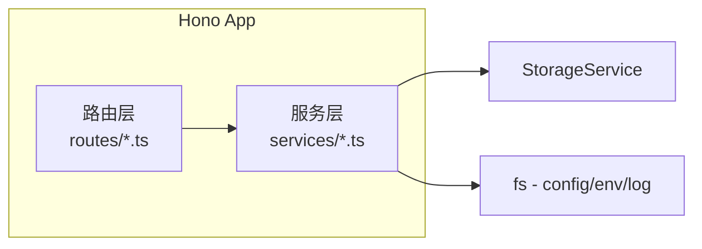

# 技术设计文档 — Web UI 管理/调试面板

## 概述

`@winches/web-ui` 是 winches-agent 的本地 Web 管理面板，提供配置管理、对话历史浏览、工具日志查看、定时任务管理、记忆管理和系统状态概览功能。

系统采用前后端分离架构：
- 后端：基于 Hono 的极简 REST API server，直接依赖 `@winches/storage` 读取 SQLite 数据库，同时读写项目根目录的 `config.yaml` 和 `.env` 文件
- 前端：React SPA，构建为静态文件由 Hono 提供服务

本设计遵循 monorepo 现有模式（tsdown 构建、ESM only、TypeScript strict mode），后端代码通过 tsdown 编译，前端通过 Vite 构建后输出到 `dist/client/` 目录。

## 架构

### 整体架构图

```mermaid
graph TB
    subgraph Browser
        SPA[React SPA]
    end

    subgraph "Hono Server (localhost:3000)"
        StaticFiles[静态文件服务<br/>dist/client/]
        APIRouter[/api/* 路由]
        SPAFallback[SPA Fallback<br/>非 /api 路由 → index.html]
    end

    subgraph "数据源"
        Storage[(StorageService<br/>SQLite)]
        ConfigYAML[config.yaml]
        EnvFile[.env / .env.example]
        LogFile[data/agent.log]
    end

    SPA -->|HTTP REST| APIRouter
    SPA -->|GET /| StaticFiles
    APIRouter --> Storage
    APIRouter --> ConfigYAML
    APIRouter --> EnvFile
    APIRouter --> LogFile
    StaticFiles --> SPAFallback
```

### 后端分层



后端采用两层结构：
1. 路由层（routes）：定义 HTTP 端点，处理请求参数校验和响应格式化
2. 服务层（services）：封装业务逻辑，与 StorageService 和文件系统交互

### 前端结构

React SPA 使用 React Router 实现客户端路由，通过 fetch 调用后端 REST API。前端通过 Vite 构建，产物输出到 `packages/web-ui/dist/client/`。

## 组件与接口

### 后端 API 端点

| 方法  | 路径                         | 说明                                         | 对应需求 |
| ----- | ---------------------------- | -------------------------------------------- | -------- |
| GET   | `/api/status`                | 系统状态概览                                 | 需求 9   |
| GET   | `/api/config`                | 获取 config.yaml 配置                        | 需求 2   |
| PUT   | `/api/config`                | 修改 config.yaml 配置                        | 需求 3   |
| GET   | `/api/env`                   | 获取 .env 变量（遮蔽值）                     | 需求 2   |
| PUT   | `/api/env`                   | 修改 .env 变量                               | 需求 3   |
| GET   | `/api/sessions`              | 会话列表                                     | 需求 4   |
| GET   | `/api/sessions/:id/messages` | 会话消息记录                                 | 需求 4   |
| GET   | `/api/tool-logs`             | 工具执行日志（支持 toolName/sessionId 筛选） | 需求 5   |
| GET   | `/api/logs`                  | pino 日志（支持 level 筛选）                 | 需求 6   |
| GET   | `/api/tasks`                 | 定时任务列表                                 | 需求 7   |
| PATCH | `/api/tasks/:id`             | 更新任务状态                                 | 需求 7   |
| GET   | `/api/memories/summary`      | 记忆统计概览                                 | 需求 8   |
| GET   | `/api/memories`              | 长期记忆列表                                 | 需求 8   |
| GET   | `/api/memories/search`       | 语义搜索记忆（query 参数）                   | 需求 8   |

### 后端服务层接口

```typescript
/** 配置服务 — 读写 config.yaml */
interface ConfigService {
  /** 读取 config.yaml，保留 ${...} 引用不解析 */
  getConfig(): AppConfig;
  /** 验证并写入 config.yaml，保留 ${...} 引用字段不被覆盖 */
  updateConfig(updates: Partial<AppConfig>): void;
}

/** 环境变量服务 — 读写 .env */
interface EnvService {
  /** 读取 .env，所有值遮蔽为 '••••••••'，标注 .env.example 中缺失的变量 */
  getEnvVars(): EnvVar[];
  /** 修改 .env 中已存在的变量，保留注释和空行 */
  updateEnvVars(updates: Record<string, string>): void;
}

/** 日志服务 — 读取 pino 日志文件 */
interface LogService {
  /** 读取日志文件，支持按级别筛选 */
  getLogs(options?: { level?: string; limit?: number }): LogEntry[];
}
```

### 后端模块文件结构

```
packages/web-ui/src/
├── server/
│   ├── index.ts              # Hono app 创建与启动
│   ├── routes/
│   │   ├── status.ts         # GET /api/status
│   │   ├── config.ts         # GET/PUT /api/config, GET/PUT /api/env
│   │   ├── sessions.ts       # GET /api/sessions, GET /api/sessions/:id/messages
│   │   ├── tool-logs.ts      # GET /api/tool-logs
│   │   ├── logs.ts           # GET /api/logs
│   │   ├── tasks.ts          # GET/PATCH /api/tasks
│   │   └── memories.ts       # GET /api/memories/*, GET /api/memories/search
│   ├── services/
│   │   ├── config-service.ts # config.yaml 读写
│   │   ├── env-service.ts    # .env 读写（遮蔽处理）
│   │   └── log-service.ts    # pino 日志文件读取
│   └── types.ts              # 后端类型定义
├── client/                   # React SPA 源码（Vite 构建）
│   ├── index.html
│   ├── main.tsx
│   ├── App.tsx
│   ├── pages/
│   │   ├── Dashboard.tsx
│   │   ├── Sessions.tsx
│   │   ├── ToolLogs.tsx
│   │   ├── Logs.tsx
│   │   ├── Tasks.tsx
│   │   ├── Memories.tsx
│   │   └── Config.tsx
│   ├── components/
│   │   ├── Layout.tsx        # 侧边栏 + 顶栏布局
│   │   └── Sidebar.tsx
│   └── api.ts                # fetch 封装
└── index.ts                  # 包入口，导出 startServer()
```

### 前端路由

| 路径         | 页面组件  | 说明                   |
| ------------ | --------- | ---------------------- |
| `/`          | Dashboard | 系统状态概览           |
| `/sessions`  | Sessions  | 对话历史列表 + 详情    |
| `/tool-logs` | ToolLogs  | 工具执行日志           |
| `/logs`      | Logs      | pino 日志查看          |
| `/tasks`     | Tasks     | 定时任务管理           |
| `/memories`  | Memories  | 记忆管理               |
| `/config`    | Config    | 配置管理（含环境变量） |

## 数据模型

### 后端类型

```typescript
/** config.yaml 解析后的配置结构 */
interface AppConfig {
  llm: {
    provider: string;   // "openai" | "anthropic" | "google" | "openai-compatible"
    model: string;
    apiKey: string;     // 保留 "${AGENT_API_KEY}" 原样
    baseUrl: string | null;
  };
  embedding: {
    provider: string;
    model: string;
  };
  telegram: {
    botToken: string;   // 保留 "${AGENT_TELEGRAM_TOKEN}" 原样
  };
  approval: {
    timeout: number;
    defaultAction: "reject" | "approve";
  };
  storage: {
    dbPath: string;
  };
  logging: {
    level: "debug" | "info" | "warn" | "error";
  };
}

/** .env 变量展示模型 */
interface EnvVar {
  key: string;
  maskedValue: string;    // "••••••••" 或 ""
  isSet: boolean;         // .env 中是否存在
  inExample: boolean;     // .env.example 中是否定义
}

/** pino 日志条目 */
interface LogEntry {
  timestamp: string;
  level: number;          // pino 数字级别
  levelLabel: string;     // "debug" | "info" | "warn" | "error"
  msg: string;
  [key: string]: unknown; // 附加字段
}

/** 系统状态概览 */
interface SystemStatus {
  sessionCount: number;
  recentSession: SessionInfo | null;
  memoryCount: number;
  pendingTaskCount: number;
  recentToolLogs: ToolExecutionLog[];
}
```

### 配置验证规则

| 字段                     | 验证规则                                                     |
| ------------------------ | ------------------------------------------------------------ |
| `llm.provider`           | 枚举值：`openai`, `anthropic`, `google`, `openai-compatible` |
| `approval.timeout`       | 正整数                                                       |
| `approval.defaultAction` | 枚举值：`reject`, `approve`                                  |
| `logging.level`          | 枚举值：`debug`, `info`, `warn`, `error`                     |

### .env 文件解析规则

1. 逐行解析 `.env` 文件
2. 以 `#` 开头的行视为注释，保留不修改
3. 空行保留不修改
4. `KEY=VALUE` 格式的行提取键值对
5. 写入时仅替换匹配键名的行的值部分，其余行原样保留

### ${...} 引用保护规则

当用户通过 `PUT /api/config` 修改配置时：
1. 读取原始 `config.yaml` 文本
2. 识别所有包含 `${...}` 的字段值
3. 如果用户提交的更新中包含这些字段，且新值不是 `${...}` 格式，则跳过该字段不写入
4. 仅写入不包含 `${...}` 引用的字段的变更


## 正确性属性（Correctness Properties）

*属性（Property）是指在系统所有合法执行中都应成立的特征或行为——本质上是对系统应做什么的形式化陈述。属性是人类可读规格说明与机器可验证正确性保证之间的桥梁。*

### Property 1: SPA Fallback 路由

*对于任意*不以 `/api` 开头的 HTTP GET 请求路径，Hono 服务器应返回 SPA 的 `index.html` 内容，状态码为 200。

**Validates: Requirements 1.3, 10.3**

### Property 2: .env 值遮蔽保证

*对于任意* `.env` 文件内容（包含任意 `KEY=VALUE` 对），`GET /api/env` 端点的响应中所有变量值应为 `••••••••`，且响应 JSON 中不包含任何原始明文值。

**Validates: Requirements 2.3, 2.4, 2.7**

### Property 3: ${...} 引用读取保留

*对于任意* `config.yaml` 中包含 `${...}` 环境变量引用的字段值，`GET /api/config` 端点应原样返回该占位符文本（如 `${AGENT_API_KEY}`），不解析为实际值。

**Validates: Requirements 2.2**

### Property 4: .env.example 缺失变量标注

*对于任意* `.env.example` 中定义但 `.env` 中不存在的变量键名，`GET /api/env` 端点的响应中该变量应标记为 `isSet: false`。

**Validates: Requirements 2.5**

### Property 5: 配置验证拒绝非法值

*对于任意*不在合法枚举范围内的 `llm.provider` 值、非正整数的 `approval.timeout` 值、或不在 `debug/info/warn/error` 中的 `logging.level` 值，`PUT /api/config` 应返回 400 错误且不修改文件。

**Validates: Requirements 3.2, 3.3**

### Property 6: ${...} 引用写入保护

*对于任意* `PUT /api/config` 请求，如果原始 `config.yaml` 中某字段值包含 `${...}` 引用，则该字段在写入后仍应保持原始 `${...}` 引用不变。

**Validates: Requirements 3.4**

### Property 7: 配置修改 Round-Trip

*对于任意*合法的配置更新（不涉及 `${...}` 字段），通过 `PUT /api/config` 写入后再通过 `GET /api/config` 读取，更新的字段值应与提交的值一致。

**Validates: Requirements 3.1**

### Property 8: .env 仅允许已知键名

*对于任意* `PUT /api/env` 请求中包含的键名，如果该键名既不存在于 `.env` 文件中也不存在于 `.env.example` 文件中，则请求应被拒绝。

**Validates: Requirements 3.6**

### Property 9: .env 写入保留注释和空行

*对于任意*包含注释行（`#` 开头）和空行的 `.env` 文件，通过 `PUT /api/env` 修改变量值后，文件中的注释行和空行应保持原始位置和内容不变。

**Validates: Requirements 3.8**

### Property 10: .env 修改 Round-Trip

*对于任意*已存在于 `.env` 或 `.env.example` 中的变量键名和任意新值（包括空字符串），通过 `PUT /api/env` 写入后，实际 `.env` 文件中该键的值应与提交的值一致。

**Validates: Requirements 3.5, 3.7**

### Property 11: 会话列表按活跃时间降序

*对于任意*会话列表，`GET /api/sessions` 返回的会话应按 `lastActiveAt` 降序排列，即对于返回列表中相邻的两个会话 `sessions[i]` 和 `sessions[i+1]`，`sessions[i].lastActiveAt >= sessions[i+1].lastActiveAt`。

**Validates: Requirements 4.1**

### Property 12: 消息包含角色相关完整字段

*对于任意*会话消息，`GET /api/sessions/:id/messages` 返回的每条消息应包含 `role`、`content` 和时间戳；当消息包含 `toolCalls` 时应包含工具调用名称和参数；当消息角色为 `tool` 时应包含 `toolCallId`。

**Validates: Requirements 4.3, 4.4, 4.5**

### Property 13: 工具日志筛选正确性

*对于任意*工具执行日志集合和筛选条件（`toolName` 和/或 `sessionId`），`GET /api/tool-logs` 返回的所有记录应满足所有指定的筛选条件。

**Validates: Requirements 5.3, 5.4**

### Property 14: pino 日志解析完整性

*对于任意*合法的 pino JSON 日志行，日志解析器应提取出时间戳、日志级别（数字和标签）、消息内容和所有附加字段。

**Validates: Requirements 6.1, 6.2**

### Property 15: 日志级别筛选

*对于任意*日志条目集合和筛选级别，`GET /api/logs?level=X` 返回的所有日志条目的级别应等于或高于所选级别（pino 级别数值：debug=20, info=30, warn=40, error=50）。

**Validates: Requirements 6.3**

### Property 16: 系统状态概览完整性

*对于任意*系统状态，`GET /api/status` 返回的响应应包含 `sessionCount`、`recentSession`、`memoryCount`、`pendingTaskCount` 四个字段，且 `recentToolLogs` 数组长度不超过 10。

**Validates: Requirements 9.1, 9.2**

## 错误处理

### API 层错误处理

| 场景                    | HTTP 状态码 | 响应格式                                   |
| ----------------------- | ----------- | ------------------------------------------ |
| 配置验证失败            | 400         | `{ error: string, field?: string }`        |
| 未知 .env 键名          | 400         | `{ error: string, invalidKeys: string[] }` |
| 会话/任务不存在         | 404         | `{ error: string }`                        |
| 日志文件不存在          | 404         | `{ error: string }`                        |
| config.yaml 读取失败    | 500         | `{ error: string }`                        |
| .env 文件读取失败       | 500         | `{ error: string }`                        |
| StorageService 调用失败 | 500         | `{ error: string }`                        |

### 服务层错误处理

- `ConfigService`：YAML 解析失败时抛出带文件路径的错误；写入失败时不修改原文件（先写临时文件再 rename）
- `EnvService`：.env 文件不存在时返回空列表（非错误）；.env.example 不存在时所有变量的 `inExample` 标记为 false
- `LogService`：日志文件不存在时抛出错误；JSON 解析失败的行跳过并记录警告

### 启动错误处理

- 端口被占用：输出包含端口号的错误信息，进程退出码 1
- StorageService 初始化失败：输出错误信息，进程退出码 1（Web UI 不支持降级模式，因为所有功能依赖数据库）
- config.yaml 不存在：输出错误信息，进程退出码 1

## 测试策略

### 测试框架

- 单元测试 + 属性测试：Vitest + fast-check
- HTTP 端点测试：使用 Hono 的 `app.request()` 方法进行内存级请求测试（无需启动真实 HTTP 服务器）
- 测试文件位置：`packages/web-ui/src/__tests__/*.test.ts`

### 属性测试（Property-Based Testing）

使用 `fast-check` 库，每个属性测试至少运行 100 次迭代。

每个属性测试必须通过注释引用设计文档中的属性编号：

```typescript
// Feature: web-ui-dashboard, Property 2: .env 值遮蔽保证
```

每个正确性属性由一个属性测试实现：

| 属性                         | 测试策略                                       | 生成器                                                                   |
| ---------------------------- | ---------------------------------------------- | ------------------------------------------------------------------------ |
| Property 1: SPA Fallback     | 生成随机非 /api 路径，验证返回 index.html      | `fc.webPath()` 过滤非 /api                                               |
| Property 2: .env 遮蔽        | 生成随机 KEY=VALUE 对，验证响应中无明文值      | `fc.record({ key: fc.stringMatching(/^[A-Z_]+$/), value: fc.string() })` |
| Property 3: ${...} 读取保留  | 生成包含 ${...} 引用的 YAML，验证原样返回      | `fc.string()` 构造 `${...}` 模板                                         |
| Property 5: 配置验证         | 生成非法枚举值和非正整数，验证 400 响应        | `fc.string()` 过滤合法值                                                 |
| Property 6: ${...} 写入保护  | 生成更新请求覆盖 ${...} 字段，验证字段不变     | `fc.record()`                                                            |
| Property 7: 配置 Round-Trip  | 生成合法配置更新，验证写入后读取一致           | 合法枚举值 + 正整数                                                      |
| Property 9: .env 注释保留    | 生成含注释/空行的 .env，更新后验证结构不变     | `fc.array(fc.oneof(comment, blank, keyValue))`                           |
| Property 10: .env Round-Trip | 生成已知键名和新值，验证写入后文件值一致       | `fc.string()`                                                            |
| Property 11: 会话排序        | 生成随机会话列表，验证返回降序                 | `fc.array(fc.record({ lastActiveAt: fc.date() }))`                       |
| Property 13: 工具日志筛选    | 生成随机日志和筛选条件，验证结果匹配           | `fc.record()` + `fc.constantFrom()`                                      |
| Property 14: pino 日志解析   | 生成合法 pino JSON 行，验证解析字段完整        | `fc.record({ level, time, msg, ...extras })`                             |
| Property 15: 日志级别筛选    | 生成随机日志和级别，验证筛选结果               | `fc.array(logEntry)` + `fc.constantFrom(20,30,40,50)`                    |
| Property 16: 状态概览        | mock StorageService 返回随机数据，验证字段完整 | `fc.nat()` + `fc.array(toolLog, { maxLength: 20 })`                      |

### 单元测试

单元测试覆盖属性测试不适合的场景：

- 端点存在性验证（各 API 端点返回正确状态码）
- 端口占用错误处理
- StorageService 调用失败的错误传播
- 日志文件不存在的错误处理
- 特定边界条件（空 .env 文件、空会话列表等）

### Mock 策略

- `StorageService`：mock 完整接口，返回可控数据
- 文件系统（config.yaml / .env / log）：使用临时目录 + 真实文件读写，测试后清理
- Hono app：使用 `app.request()` 进行内存级 HTTP 测试
