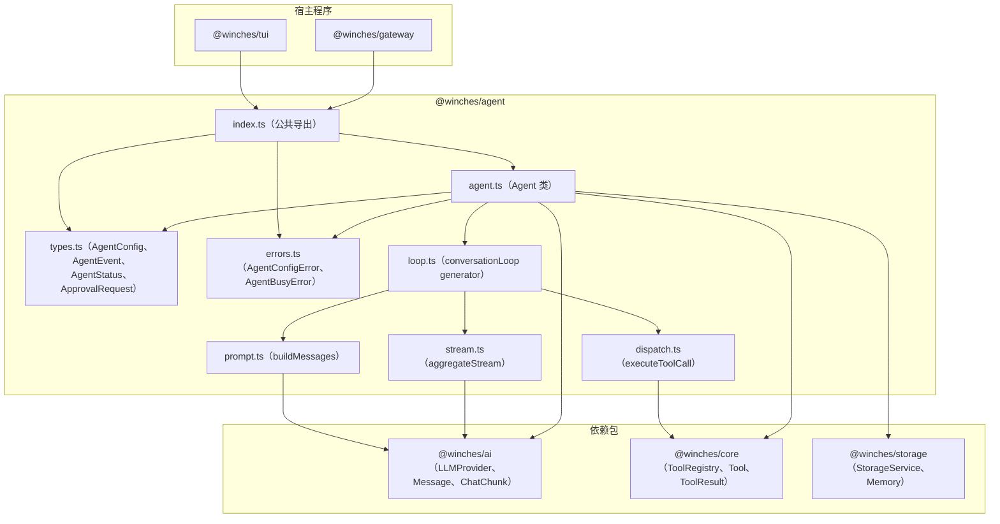
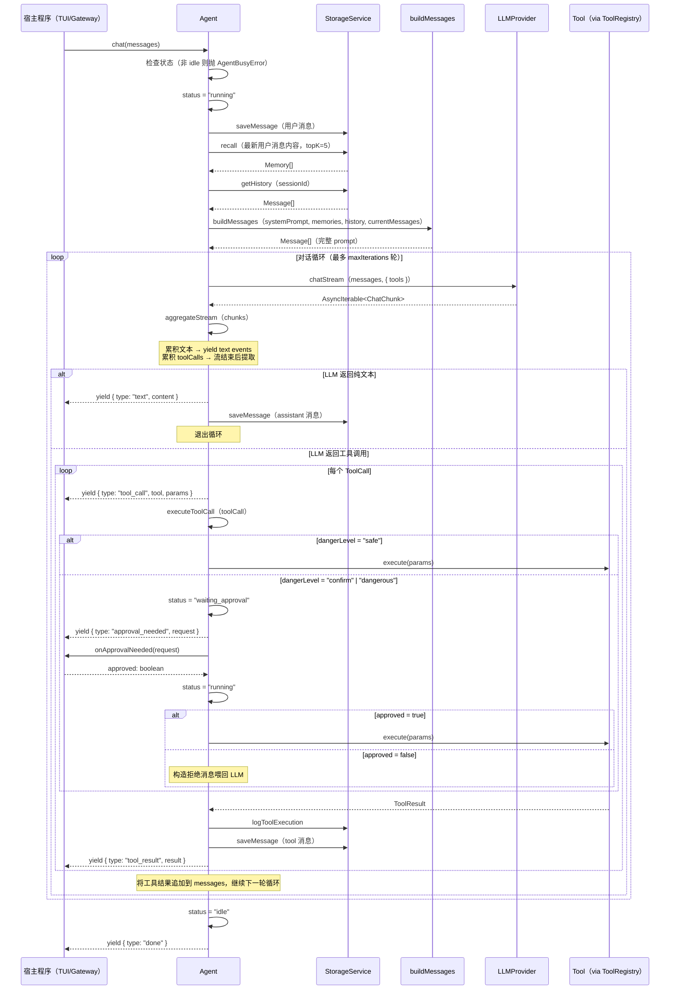

# 技术设计文档 — @winches/agent

## 概述

`@winches/agent` 是 winches-agent monorepo 的运行时核心，作为嵌入式库被 TUI 和 Gateway 直接 import 使用。它驱动完整的 AI 对话循环：检索长期记忆、构建 prompt、流式调用 LLM、解析响应、调度工具执行、处理权限审批，并以 `AsyncIterable<AgentEvent>` 的形式将过程暴露给宿主程序。

Agent 不是独立服务进程，没有 HTTP server。TUI 和 Gateway 各自创建独立的 Agent 实例，各实例拥有独立的对话历史，不共享状态。权限审批通过回调函数实现，由宿主程序驱动 UI 交互。

### 设计决策

| 决策 | 选择 | 理由 |
|------|------|------|
| 对话循环实现 | `async function*` generator | 天然支持 `yield` 流式事件，与 `AsyncIterable` 接口对齐 |
| ChatChunk 聚合 | 流内累积，done=true 时提取完整 ToolCall | 避免引入额外状态机，逻辑集中在 `aggregateStream` 函数 |
| 并发保护 | 状态标志 + 构造时检查 | 简单可靠，避免引入锁原语 |
| LLM 重试 | 内置指数退避，最多 3 次 | 与 `@winches/ai` 的 retry 模块解耦，Agent 层自行控制 |
| 审批回调缺失时 | 自动拒绝 | 安全优先，宿主程序必须显式注册回调才能执行危险操作 |
| 记忆检索失败 | 记录 warn 日志后继续 | 记忆是增强功能，不应阻断核心对话流程 |
| maxIterations 默认值 | 10 | 防止 LLM 陷入无限工具调用循环，同时给复杂任务足够空间 |

## 架构

### 整体架构图



### 对话循环时序图



## 文件结构

```
packages/agent/src/
├── index.ts          # 公共 API 导出
├── types.ts          # AgentConfig、AgentEvent、AgentStatus、ApprovalRequest
├── errors.ts         # AgentConfigError、AgentBusyError
├── agent.ts          # Agent 类（核心入口）
├── loop.ts           # conversationLoop generator（对话循环主逻辑）
├── prompt.ts         # buildMessages（prompt 构建）
├── stream.ts         # aggregateStream（ChatChunk 流聚合）
├── dispatch.ts       # executeToolCall（工具调度）
└── __tests__/
    ├── agent.test.ts         # Agent 类单元测试 + 属性测试（Property 2、7）
    ├── loop.test.ts          # 对话循环单元测试（Property 1、3、4、5、8）
    ├── prompt.test.ts        # buildMessages 单元测试
    ├── stream.test.ts        # aggregateStream 单元测试
    └── dispatch.test.ts      # executeToolCall 单元测试（Property 3、4、5、6）
```

## 核心类型定义（types.ts）

```typescript
import type { Message } from "@winches/ai";
import type { LLMProvider } from "@winches/ai";
import type { ToolRegistry } from "@winches/core";
import type { StorageService } from "@winches/storage";
import type { ToolResult } from "@winches/core";
import type { DangerLevel } from "@winches/core";

/** Agent 构造配置 */
export interface AgentConfig {
  /** LLM Provider 实例（必填） */
  provider: LLMProvider;
  /** 持久化服务实例（必填） */
  storage: StorageService;
  /** 工具注册表实例（必填） */
  registry: ToolRegistry;
  /** 会话 ID（必填） */
  sessionId: string;
  /** 自定义 system prompt（可选，默认使用内置 prompt） */
  systemPrompt?: string;
  /** 单次 chat 调用的最大工具调用轮次（可选，默认 10） */
  maxIterations?: number;
}

/** Agent 运行状态 */
export type AgentStatus = "idle" | "running" | "waiting_approval";

/** 需要用户审批的工具调用请求 */
export interface ApprovalRequest {
  /** 工具名称 */
  toolName: string;
  /** 工具调用参数（已解析的 JSON 对象） */
  params: unknown;
  /** 危险等级 */
  dangerLevel: DangerLevel;
}

/** Agent 流式事件（判别联合类型） */
export type AgentEvent =
  | { type: "text"; content: string }
  | { type: "tool_call"; tool: string; params: unknown }
  | { type: "tool_result"; result: ToolResult }
  | { type: "approval_needed"; request: ApprovalRequest }
  | { type: "done" };
```

## 错误类型（errors.ts）

```typescript
/** Agent 包基础错误 */
export class AgentError extends Error {
  constructor(message: string, options?: { cause?: unknown }) {
    super(message, options);
    this.name = "AgentError";
  }
}

/**
 * AgentConfig 校验失败错误
 * 在构造函数中缺少必填字段时抛出
 */
export class AgentConfigError extends AgentError {
  /** 缺失的字段名称 */
  public readonly missingField: string;

  constructor(missingField: string) {
    super(`AgentConfig missing required field: "${missingField}"`);
    this.name = "AgentConfigError";
    this.missingField = missingField;
  }
}

/**
 * Agent 并发调用错误
 * 当 Agent 正在处理请求时再次调用 chat 时抛出
 */
export class AgentBusyError extends AgentError {
  /** 当前 Agent 状态 */
  public readonly currentStatus: AgentStatus;

  constructor(currentStatus: AgentStatus) {
    super(`Agent is busy (status: "${currentStatus}"). Wait for current chat to complete.`);
    this.name = "AgentBusyError";
    this.currentStatus = currentStatus;
  }
}
```

## Agent 类设计（agent.ts）

```typescript
import pino from "pino";
import type { Message } from "@winches/ai";
import type { AgentConfig, AgentEvent, AgentStatus, ApprovalRequest } from "./types.js";
import { AgentConfigError, AgentBusyError } from "./errors.js";
import { conversationLoop } from "./loop.js";

const REQUIRED_FIELDS: (keyof AgentConfig)[] = ["provider", "storage", "registry", "sessionId"];
const DEFAULT_MAX_ITERATIONS = 10;
const DEFAULT_SYSTEM_PROMPT = `You are a helpful personal assistant with access to tools for file operations, web browsing, and system management. Use tools when needed to complete tasks. Always explain what you're doing before using a tool.`;

export class Agent {
  private readonly config: Required<AgentConfig>;
  private status: AgentStatus = "idle";
  private readonly logger = pino({ name: "@winches/agent" });

  /**
   * 审批回调，由宿主程序注册。
   * 未注册时，所有需要审批的工具调用自动拒绝。
   */
  onApprovalNeeded: ((request: ApprovalRequest) => Promise<boolean>) | undefined;

  constructor(config: AgentConfig) {
    // 校验必填字段
    for (const field of REQUIRED_FIELDS) {
      if (config[field] == null) {
        throw new AgentConfigError(field);
      }
    }

    this.config = {
      ...config,
      systemPrompt: config.systemPrompt ?? DEFAULT_SYSTEM_PROMPT,
      maxIterations: config.maxIterations ?? DEFAULT_MAX_ITERATIONS,
    };
  }

  /**
   * 核心对话方法，流式返回 AgentEvent。
   * 保证最后一个事件为 { type: "done" }。
   *
   * @throws {AgentBusyError} 当 Agent 正在处理另一个请求时
   */
  async *chat(messages: Message[]): AsyncIterable<AgentEvent> {
    if (this.status !== "idle") {
      throw new AgentBusyError(this.status);
    }

    this.status = "running";
    this.logger.debug({ sessionId: this.config.sessionId }, "chat started");

    try {
      yield* conversationLoop({
        messages,
        config: this.config,
        getStatus: () => this.status,
        setStatus: (s) => { this.status = s; },
        onApprovalNeeded: this.onApprovalNeeded,
        logger: this.logger,
      });
    } finally {
      this.status = "idle";
    }
  }

  /** 查询当前运行状态 */
  getStatus(): AgentStatus {
    return this.status;
  }
}
```

### 内部状态说明

| 字段 | 类型 | 说明 |
|------|------|------|
| `config` | `Required<AgentConfig>` | 构造时填充默认值后的完整配置，只读 |
| `status` | `AgentStatus` | 当前运行状态，由 `conversationLoop` 通过 `setStatus` 回调修改 |
| `logger` | `pino.Logger` | 结构化日志实例，绑定包名 |
| `onApprovalNeeded` | `function \| undefined` | 宿主程序注册的审批回调，公开可赋值 |

## 流式 ChatChunk 聚合（stream.ts）

LLM 通过 `chatStream` 返回 `AsyncIterable<ChatChunk>`，每个 chunk 可能包含部分文本或部分工具调用。需要将流聚合为完整的文本和工具调用列表。

### 聚合逻辑设计

```typescript
import type { ChatChunk, ToolCall } from "@winches/ai";

/** 聚合后的完整 LLM 响应 */
export interface AggregatedResponse {
  /** 完整文本内容（可能为空字符串） */
  content: string;
  /** 完整工具调用列表（可能为空数组） */
  toolCalls: ToolCall[];
}

/**
 * 将 ChatChunk 流聚合为完整响应，同时 yield 文本增量事件。
 *
 * 设计要点：
 * - 文本内容：每个 chunk.content 直接 yield，同时累积到 content 字符串
 * - 工具调用：按 index 分组累积，done=true 时提取完整 ToolCall
 *   - chunk.toolCalls[i].id 出现时初始化该 index 的累积对象
 *   - chunk.toolCalls[i].arguments 追加到对应 index 的 arguments 字符串
 *   - chunk.toolCalls[i].name 出现时设置工具名称
 * - done=true 时：验证所有累积的 ToolCall 字段完整性，返回 AggregatedResponse
 */
export async function* aggregateStream(
  stream: AsyncIterable<ChatChunk>,
): AsyncGenerator<{ type: "text_delta"; content: string }, AggregatedResponse> {
  let content = "";
  // key: index（chunk 中 toolCalls 数组的位置），value: 累积中的 ToolCall
  const toolCallAccumulators = new Map<number, Partial<ToolCall> & { arguments: string }>();

  for await (const chunk of stream) {
    // 累积文本
    if (chunk.content) {
      content += chunk.content;
      yield { type: "text_delta", content: chunk.content };
    }

    // 累积工具调用（按 index 分组）
    if (chunk.toolCalls) {
      for (let i = 0; i < chunk.toolCalls.length; i++) {
        const partial = chunk.toolCalls[i];
        if (!toolCallAccumulators.has(i)) {
          toolCallAccumulators.set(i, { arguments: "" });
        }
        const acc = toolCallAccumulators.get(i)!;
        if (partial.id) acc.id = partial.id;
        if (partial.name) acc.name = partial.name;
        if (partial.arguments) acc.arguments += partial.arguments;
      }
    }
  }

  // 提取完整 ToolCall（过滤掉字段不完整的条目）
  const toolCalls: ToolCall[] = [];
  for (const [, acc] of toolCallAccumulators) {
    if (acc.id && acc.name) {
      toolCalls.push({ id: acc.id, name: acc.name, arguments: acc.arguments });
    }
  }

  return { content, toolCalls };
}
```

### 关键设计决策

- **按 index 分组**：不同 provider 的流式 tool call 格式不同，但都通过数组 index 标识同一个工具调用的不同 chunk，这是最通用的聚合方式
- **arguments 追加**：`arguments` 是 JSON 字符串，各 provider 均以增量方式流式输出，必须字符串拼接后再 `JSON.parse`
- **generator return value**：使用 generator 的 return value 传递最终聚合结果，调用方通过 `for await...of` 消费文本增量，通过 `.next()` 的最终 `{ done: true, value }` 获取完整响应

## Prompt 构建（prompt.ts）

```typescript
import type { Message } from "@winches/ai";
import type { Memory } from "@winches/storage";

/**
 * 构建发送给 LLM 的完整消息列表。
 *
 * 消息顺序：
 * 1. system 消息（systemPrompt + 记忆区块）
 * 2. 历史消息（来自 storage.getHistory）
 * 3. 当前用户消息（本次 chat 传入的 messages）
 *
 * @param systemPrompt  基础 system prompt 文本
 * @param memories      storage.recall 返回的记忆列表（可为空数组）
 * @param history       storage.getHistory 返回的历史消息
 * @param currentMessages 本次 chat 调用传入的消息
 */
export function buildMessages(
  systemPrompt: string,
  memories: Memory[],
  history: Message[],
  currentMessages: Message[],
): Message[] {
  // 构建 system 消息内容
  let systemContent = systemPrompt;

  if (memories.length > 0) {
    const memoryLines = memories.map((m) => m.content).join("\n");
    systemContent += `\n\n<memory>\n${memoryLines}\n</memory>`;
  }

  const systemMessage: Message = {
    role: "system",
    content: systemContent,
  };

  return [systemMessage, ...history, ...currentMessages];
}
```

### 记忆注入格式示例

```
You are a helpful personal assistant...

<memory>
用户偏好使用 vim 编辑器
用户的工作目录通常在 ~/projects
用户不喜欢冗长的解释，倾向于直接给出结论
</memory>
```

## 工具调度（dispatch.ts）

```typescript
import type { ToolCall } from "@winches/ai";
import type { ToolRegistry, ToolResult } from "@winches/core";
import type { StorageService } from "@winches/storage";
import type { ApprovalRequest, AgentStatus } from "./types.js";
import pino from "pino";

export interface DispatchContext {
  registry: ToolRegistry;
  storage: StorageService;
  sessionId: string;
  setStatus: (status: AgentStatus) => void;
  onApprovalNeeded: ((request: ApprovalRequest) => Promise<boolean>) | undefined;
  logger: pino.Logger;
}

export interface DispatchResult {
  toolResult: ToolResult;
  /** 工具是否被拒绝（未执行） */
  rejected: boolean;
}

/**
 * 执行单个工具调用，处理权限审批逻辑。
 *
 * 流程：
 * 1. 从 registry 查找工具（未找到则返回错误 ToolResult）
 * 2. 解析 arguments JSON（解析失败则返回错误 ToolResult）
 * 3. 根据 dangerLevel 决定是否需要审批
 * 4. 执行工具，捕获所有异常
 * 5. 记录 logToolExecution
 */
export async function executeToolCall(
  toolCall: ToolCall,
  ctx: DispatchContext,
): Promise<DispatchResult> {
  const { registry, storage, sessionId, setStatus, onApprovalNeeded, logger } = ctx;

  // 1. 查找工具
  const tool = registry.get(toolCall.name);
  if (!tool) {
    logger.warn({ toolName: toolCall.name }, "tool not found in registry");
    return {
      toolResult: { success: false, error: `Tool "${toolCall.name}" is not registered` },
      rejected: false,
    };
  }

  // 2. 解析参数
  let params: unknown;
  try {
    params = JSON.parse(toolCall.arguments || "{}");
  } catch {
    return {
      toolResult: { success: false, error: `Invalid JSON arguments for tool "${toolCall.name}"` },
      rejected: false,
    };
  }

  logger.debug({ toolName: toolCall.name, dangerLevel: tool.dangerLevel }, "executing tool");

  // 3. 权限审批
  if (tool.dangerLevel !== "safe") {
    const request: ApprovalRequest = {
      toolName: toolCall.name,
      params,
      dangerLevel: tool.dangerLevel,
    };

    setStatus("waiting_approval");

    let approved = false;
    if (onApprovalNeeded) {
      approved = await onApprovalNeeded(request);
    }

    setStatus("running");

    if (!approved) {
      logger.info({ toolName: toolCall.name, reason: onApprovalNeeded ? "user_rejected" : "no_callback" }, "tool call rejected");
      return {
        toolResult: { success: false, error: `Tool "${toolCall.name}" was rejected by user` },
        rejected: true,
      };
    }
  }

  // 4. 执行工具
  const startTime = Date.now();
  let toolResult: ToolResult;

  try {
    toolResult = await tool.execute(params);
  } catch (err) {
    const message = err instanceof Error ? err.message : String(err);
    logger.error({ toolName: toolCall.name, err }, "tool execution threw unexpected error");
    toolResult = { success: false, error: message };
  }

  // 5. 记录执行日志
  const durationMs = Date.now() - startTime;
  await storage.logToolExecution(toolCall.name, params, toolResult, durationMs, sessionId).catch((err) => {
    logger.warn({ err }, "failed to log tool execution");
  });

  return { toolResult, rejected: false };
}
```

## 对话循环（loop.ts）

```typescript
import type { Message } from "@winches/ai";
import type { Required as RequiredConfig } from "./types.js";  // AgentConfig with defaults filled
import type { AgentEvent, AgentStatus, ApprovalRequest } from "./types.js";
import type pino from "pino";
import { registryToToolDefinitions } from "@winches/core";
import { buildMessages } from "./prompt.js";
import { aggregateStream } from "./stream.js";
import { executeToolCall } from "./dispatch.js";

const RETRY_DELAYS_MS = [1000, 2000, 4000];

export interface LoopContext {
  messages: Message[];
  config: Required<AgentConfig>;
  getStatus: () => AgentStatus;
  setStatus: (s: AgentStatus) => void;
  onApprovalNeeded: ((request: ApprovalRequest) => Promise<boolean>) | undefined;
  logger: pino.Logger;
}

/**
 * 核心对话循环 generator。
 * 保证最后一个 yield 为 { type: "done" }。
 */
export async function* conversationLoop(ctx: LoopContext): AsyncGenerator<AgentEvent> {
  const { messages, config, logger } = ctx;
  const { provider, storage, registry, sessionId, systemPrompt, maxIterations } = config;

  // 保存用户消息
  for (const msg of messages) {
    await storage.saveMessage(sessionId, msg);
  }

  // 检索记忆
  const lastUserMessage = [...messages].reverse().find((m) => m.role === "user");
  let memories = [];
  if (lastUserMessage) {
    try {
      memories = await storage.recall(
        typeof lastUserMessage.content === "string" ? lastUserMessage.content : "",
        5,
      );
    } catch (err) {
      logger.warn({ err }, "memory recall failed, continuing without memories");
    }
  }

  // 加载历史
  const history = await storage.getHistory(sessionId);

  // 构建初始 prompt
  let loopMessages = buildMessages(systemPrompt, memories, history, messages);
  const toolDefinitions = registryToToolDefinitions(registry);

  let iterations = 0;

  while (iterations < maxIterations) {
    iterations++;

    // 带重试的 LLM 调用
    let stream: AsyncIterable<import("@winches/ai").ChatChunk>;
    let lastError: unknown;

    for (let attempt = 0; attempt <= RETRY_DELAYS_MS.length; attempt++) {
      try {
        stream = provider.chatStream(loopMessages, { tools: toolDefinitions });
        lastError = undefined;
        break;
      } catch (err) {
        lastError = err;
        if (attempt < RETRY_DELAYS_MS.length) {
          logger.warn({ attempt: attempt + 1, err }, "LLM call failed, retrying");
          await sleep(RETRY_DELAYS_MS[attempt]);
        }
      }
    }

    if (lastError !== undefined) {
      const message = lastError instanceof Error ? lastError.message : String(lastError);
      logger.error({ err: lastError }, "LLM call failed after all retries");
      yield { type: "text", content: `Error: LLM call failed after retries. ${message}` };
      yield { type: "done" };
      return;
    }

    // 聚合流式响应
    const gen = aggregateStream(stream!);
    let chunk = await gen.next();

    while (!chunk.done) {
      if (chunk.value.type === "text_delta") {
        yield { type: "text", content: chunk.value.content };
      }
      chunk = await gen.next();
    }

    const { content, toolCalls } = chunk.value;

    // 纯文本回复 → 保存并结束循环
    if (toolCalls.length === 0) {
      if (content) {
        await storage.saveMessage(sessionId, { role: "assistant", content });
      }
      break;
    }

    // 保存 assistant 消息（含工具调用）
    await storage.saveMessage(sessionId, {
      role: "assistant",
      content: content || "",
    });

    // 追加 assistant 消息到循环消息列表
    loopMessages = [
      ...loopMessages,
      { role: "assistant", content: content || "", toolCalls } as Message,
    ];

    // 执行工具调用
    for (const toolCall of toolCalls) {
      yield { type: "tool_call", tool: toolCall.name, params: JSON.parse(toolCall.arguments || "{}") };

      const { toolResult, rejected } = await executeToolCall(toolCall, {
        registry,
        storage,
        sessionId,
        setStatus: ctx.setStatus,
        onApprovalNeeded: ctx.onApprovalNeeded,
        logger,
      });

      yield { type: "tool_result", result: toolResult };

      // 构建 tool 角色消息
      const toolMessage: Message = {
        role: "tool",
        toolCallId: toolCall.id,
        content: rejected
          ? `Tool "${toolCall.name}" was rejected by user`
          : toolResult.success
            ? JSON.stringify(toolResult.data)
            : toolResult.error,
      };

      await storage.saveMessage(sessionId, toolMessage);
      loopMessages = [...loopMessages, toolMessage];
    }
  }

  yield { type: "done" };
}

function sleep(ms: number): Promise<void> {
  return new Promise((resolve) => setTimeout(resolve, ms));
}
```

## index.ts 导出设计

```typescript
// 核心类
export { Agent } from "./agent.js";

// 类型
export type {
  AgentConfig,
  AgentEvent,
  AgentStatus,
  ApprovalRequest,
} from "./types.js";

// 错误
export { AgentError, AgentConfigError, AgentBusyError } from "./errors.js";
```

宿主程序只需 `import { Agent } from "@winches/agent"` 即可使用全部功能。内部模块（loop、prompt、stream、dispatch）不对外导出，保持封装性。

## 正确性属性（Correctness Properties）

*属性是指在系统所有合法执行中都应成立的特征或行为，是对系统应做什么的形式化陈述。*

### Property 1：chat 方法始终以 done 事件结束

*For any* 合法的 `messages` 输入（包括 LLM 返回纯文本、工具调用、重试失败等场景），`chat` 方法产生的 `AgentEvent` 序列中，最后一个事件的 `type` 应为 `"done"`。

**验证需求：2.8、7.2**

**测试方法**：使用 fast-check 生成随机消息序列，mock LLM provider 返回随机响应（文本/工具调用/错误），验证事件序列末尾始终为 `{ type: "done" }`。

### Property 2：状态机转换合法性

*For any* Agent 实例，`getStatus()` 的返回值应始终为 `"idle"`、`"running"`、`"waiting_approval"` 三者之一，且 `chat` 调用结束后（无论成功或异常）状态应回到 `"idle"`。

**验证需求：6.2、6.3、6.4、6.5**

**测试方法**：在 `chat` 执行过程中多次采样 `getStatus()`，验证值合法；`chat` 完成后验证状态为 `"idle"`；即使 LLM 抛出异常，`finally` 块保证状态重置。

### Property 3：safe 工具不触发审批回调

*For any* `dangerLevel` 为 `"safe"` 的工具调用，`onApprovalNeeded` 回调不应被调用。

**验证需求：3.1**

**测试方法**：注册一个 `dangerLevel: "safe"` 的 mock 工具，设置 `onApprovalNeeded` 为 spy，验证 spy 未被调用。

### Property 4：confirm/dangerous 工具必须经过审批

*For any* `dangerLevel` 为 `"confirm"` 或 `"dangerous"` 的工具调用，工具的 `execute` 方法被调用前，`onApprovalNeeded` 回调必须已被调用且返回 `true`。

**验证需求：3.2、3.3**

**测试方法**：使用 fast-check 生成随机 `dangerLevel`（confirm/dangerous），验证 `execute` 调用顺序在 `onApprovalNeeded` 之后。

### Property 5：被拒绝的工具不被执行

*For any* `onApprovalNeeded` 返回 `false` 的工具调用，该工具的 `execute` 方法不应被调用。

**验证需求：3.4**

**测试方法**：设置 `onApprovalNeeded` 始终返回 `false`，验证 mock 工具的 `execute` 从未被调用。

### Property 6：对话历史保存完整性

*For any* 一次 `chat` 调用，传入的用户消息和 LLM 生成的 assistant 消息都应通过 `storage.saveMessage` 保存，且 `sessionId` 与构造时传入的一致。

**验证需求：4.1、4.2**

**测试方法**：使用 mock StorageService 记录所有 `saveMessage` 调用，验证用户消息和 assistant 消息均被保存，且 sessionId 正确。

### Property 7：并发调用抛出 AgentBusyError

*For any* 正在执行 `chat` 的 Agent 实例，再次调用 `chat` 应抛出 `AgentBusyError`，而不是产生两个并发的对话循环。

**验证需求：9.1**

**测试方法**：启动一个长时间运行的 `chat`（mock LLM 延迟响应），在其执行期间再次调用 `chat`，验证抛出 `AgentBusyError`。

### Property 8：maxIterations 限制工具调用轮次

*For any* 配置了 `maxIterations = N` 的 Agent，单次 `chat` 调用中工具调用的轮次不应超过 N 次。

**验证需求：2.10**

**测试方法**：使用 fast-check 生成随机 `maxIterations`（1-20），mock LLM 始终返回工具调用，统计 `tool_call` 事件数量，验证不超过 `maxIterations`。

## 错误处理策略

### 错误类型与处理策略

| 场景 | 错误类型 | 处理策略 |
|------|----------|----------|
| AgentConfig 缺少必填字段 | `AgentConfigError` | 构造时立即抛出，包含缺失字段名 |
| 并发调用 chat | `AgentBusyError` | 立即抛出，包含当前状态 |
| LLM 调用失败 | 内部重试 | 指数退避重试 3 次（1s/2s/4s），全部失败后 yield 错误文本事件 + done |
| 工具未注册 | `ToolResult { success: false }` | 返回包含工具名的错误消息喂回 LLM，继续循环 |
| 工具参数 JSON 解析失败 | `ToolResult { success: false }` | 返回解析错误消息喂回 LLM，继续循环 |
| 工具执行返回 `success: false` | `ToolResult { success: false }` | 将 error 字段作为 tool 消息喂回 LLM，继续循环 |
| 工具执行抛出异常 | 捕获后转为 `ToolResult` | 捕获异常，记录 error 日志，将异常消息作为 tool 消息喂回 LLM |
| 工具被拒绝 | `ToolResult { success: false }` | 返回拒绝消息喂回 LLM，继续循环（工具未执行） |
| 记忆检索失败 | 降级处理 | 记录 warn 日志，跳过记忆注入，继续对话 |
| logToolExecution 失败 | 降级处理 | 记录 warn 日志，不中断主流程 |
| chat 内部不可恢复错误 | 重新抛出 | `finally` 块重置状态为 `"idle"`，错误向上传播给宿主程序 |

### 日志级别策略

| 事件 | 级别 | 包含字段 |
|------|------|----------|
| chat 开始 | `debug` | `sessionId` |
| 工具被调用 | `debug` | `toolName`, `dangerLevel` |
| 工具调用被拒绝 | `info` | `toolName`, `reason`（user_rejected / no_callback） |
| LLM 调用失败触发重试 | `warn` | `attempt`, `err` |
| 记忆检索失败 | `warn` | `err` |
| logToolExecution 失败 | `warn` | `err` |
| 工具执行抛出异常 | `error` | `toolName`, `err` |
| LLM 全部重试失败 | `error` | `err` |

## 测试策略

### 测试框架

- **单元测试**：Vitest
- **属性测试**：fast-check（每个属性最少 100 次迭代）

### Mock 策略

所有外部依赖通过接口 mock，不依赖真实 LLM 或数据库：

```typescript
// mock LLMProvider
const mockProvider: LLMProvider = {
  name: "mock",
  chat: vi.fn(),
  chatStream: vi.fn().mockImplementation(async function* () {
    yield { content: "Hello!" };
    yield { done: true };
  }),
};

// mock StorageService
const mockStorage: StorageService = {
  saveMessage: vi.fn().mockResolvedValue(undefined),
  getHistory: vi.fn().mockResolvedValue([]),
  recall: vi.fn().mockResolvedValue([]),
  logToolExecution: vi.fn().mockResolvedValue(undefined),
  // ... 其他方法
};

// mock ToolRegistry
const mockRegistry = new ToolRegistry();
mockRegistry.register({
  name: "test.safe",
  description: "safe test tool",
  parameters: {},
  dangerLevel: "safe",
  execute: vi.fn().mockResolvedValue({ success: true, data: "ok" }),
});
```

### 单元测试范围

- `Agent` 构造函数：必填字段校验、默认值填充
- `Agent.chat`：并发保护、状态转换、事件序列
- `buildMessages`：消息顺序、记忆注入格式、空记忆时不注入
- `aggregateStream`：纯文本聚合、工具调用聚合、混合响应
- `executeToolCall`：safe 工具直接执行、confirm/dangerous 工具审批流程、工具未注册、参数解析失败、执行异常捕获

### 属性测试范围

每个属性测试对应设计文档中的一个正确性属性：

- **Property 1**：fast-check 生成随机消息，mock LLM 返回随机响应，验证末尾为 `done`
  - Tag: `Feature: winches-agent, Property 1: chat 方法始终以 done 事件结束`
- **Property 2**：验证状态值合法性和 chat 后状态重置
  - Tag: `Feature: winches-agent, Property 2: 状态机转换合法性`
- **Property 3**：safe 工具不触发审批回调
  - Tag: `Feature: winches-agent, Property 3: safe 工具不触发审批回调`
- **Property 4**：confirm/dangerous 工具必须经过审批
  - Tag: `Feature: winches-agent, Property 4: confirm/dangerous 工具必须经过审批`
- **Property 5**：被拒绝的工具不被执行
  - Tag: `Feature: winches-agent, Property 5: 被拒绝的工具不被执行`
- **Property 6**：对话历史保存完整性
  - Tag: `Feature: winches-agent, Property 6: 对话历史保存完整性`
- **Property 7**：并发调用抛出 AgentBusyError
  - Tag: `Feature: winches-agent, Property 7: 并发调用抛出 AgentBusyError`
- **Property 8**：maxIterations 限制工具调用轮次
  - Tag: `Feature: winches-agent, Property 8: maxIterations 限制工具调用轮次`

### 测试文件结构

```
packages/agent/src/__tests__/
├── agent.test.ts       # Agent 类：构造、状态、并发保护（Property 2、7）
├── loop.test.ts        # 对话循环：事件序列、重试、maxIterations（Property 1、8）
├── prompt.test.ts      # buildMessages：消息顺序、记忆注入
├── stream.test.ts      # aggregateStream：文本聚合、工具调用聚合
└── dispatch.test.ts    # executeToolCall：权限审批、工具执行（Property 3、4、5、6）
```

## 依赖

| 包 | 版本约束 | 用途 |
|----|----------|------|
| `@winches/ai` | workspace:* | LLMProvider、Message、ChatChunk、ToolCall 类型 |
| `@winches/core` | workspace:* | ToolRegistry、Tool、ToolResult、registryToToolDefinitions |
| `@winches/storage` | workspace:* | StorageService、Memory |
| `pino` | ^9.x | 结构化日志 |

开发依赖：

| 包 | 用途 |
|----|------|
| `vitest` | 单元测试框架 |
| `fast-check` | 属性测试库 |
| `tsdown` | 构建工具 |
| `typescript` | TypeScript 编译器（strict mode） |
