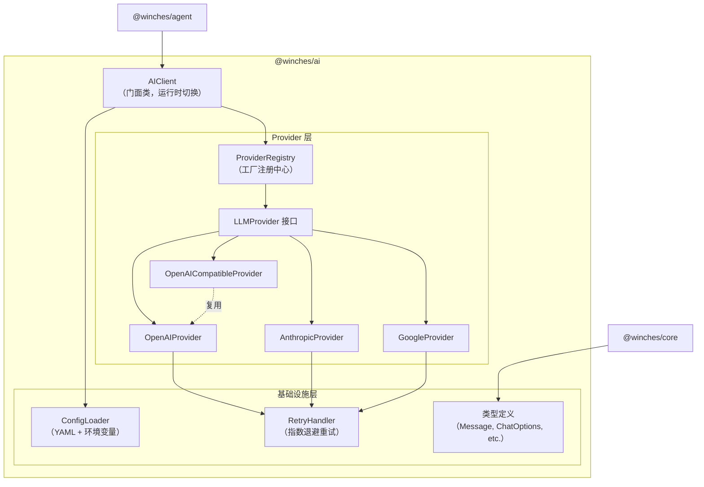
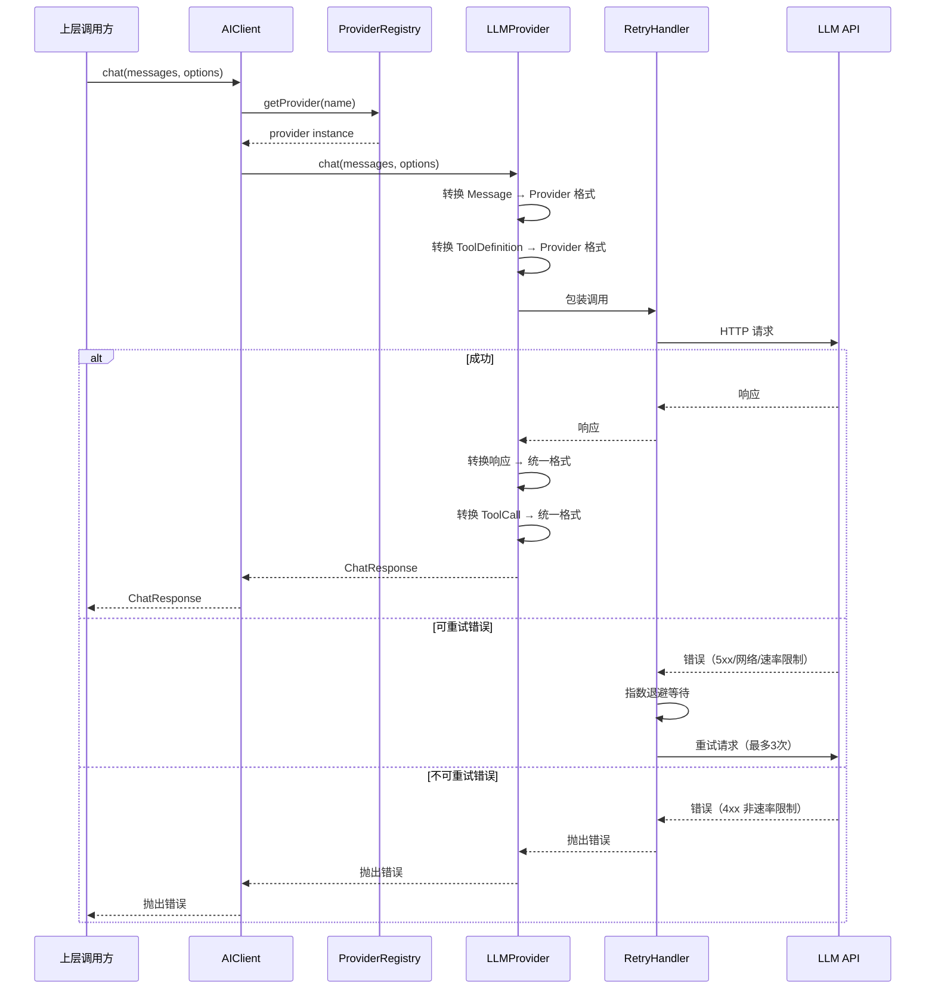
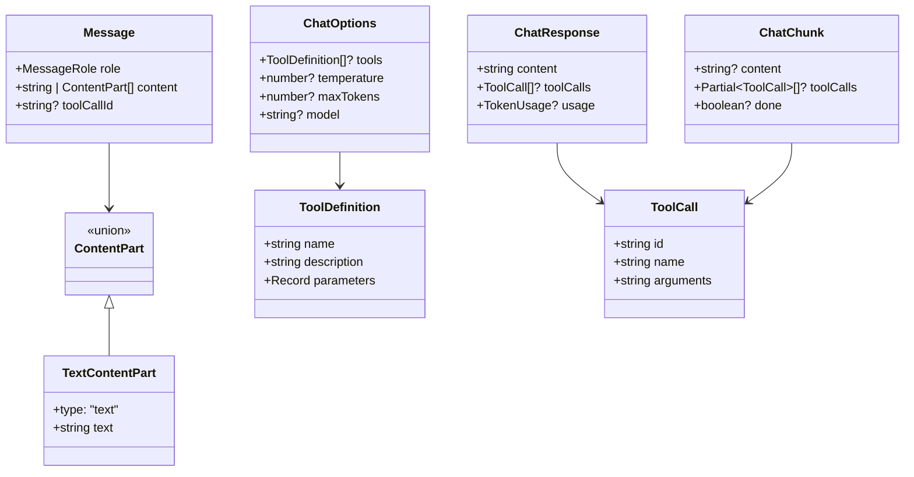

# 技术设计文档 — @winches/ai 统一 LLM 抽象层

## 概述

`@winches/ai` 是 winches-agent monorepo 中最底层的包（零外部包依赖），为上层包提供统一的多 Provider LLM 调用接口。该包的核心职责是抹平 OpenAI、Anthropic、Google Gemini 和 OpenAI 兼容接口之间的 API 差异，对外暴露一致的 `chat` / `chatStream` 接口，并内置自动重试、配置加载和运行时 Provider 切换能力。

### 设计目标

- 统一接口：上层代码通过 `LLMProvider` 接口调用任意 LLM，无需感知 Provider 差异
- 流式优先：`chatStream` 返回 `AsyncIterable<ChatChunk>`，是一等公民
- Tool Calling 抹平：不同 Provider 的工具调用格式在内部转换，对外统一为 `ToolCall`
- 可扩展：通过 Provider Registry 支持注册自定义 Provider
- 零运行时依赖：仅使用各 Provider 的官方 SDK 作为 peer/optional dependency，核心逻辑不依赖第三方库

### 设计决策

| 决策 | 选择 | 理由 |
|------|------|------|
| Provider SDK 引入方式 | 各 Provider SDK 作为 optional peerDependencies | 用户只需安装实际使用的 Provider SDK，减小包体积 |
| 流式实现 | 原生 AsyncIterable + AsyncGenerator | 不引入 RxJS 等流处理库，保持零依赖 |
| 配置加载 | 内置简单 YAML 解析 + 环境变量替换 | 配置格式简单，不需要引入 yaml 解析库，使用轻量的 `yaml` 包 |
| 重试策略 | 内置指数退避重试 | 不引入 retry 库，逻辑简单可控 |
| 日志 | 使用 pino | 与 monorepo 统一日志方案一致 |

## 架构

### 整体架构图



### 调用流程



## 组件与接口

### 1. AIClient — 门面类

`AIClient` 是对外暴露的主入口，封装 Provider 选择、运行时切换和配置加载。

```typescript
class AIClient {
  private currentProvider: LLMProvider;
  private registry: ProviderRegistry;
  private config: LLMConfig;

  constructor(config: LLMConfig);

  /** 非流式聊天 */
  chat(messages: Message[], options?: ChatOptions): Promise<ChatResponse>;

  /** 流式聊天 */
  chatStream(messages: Message[], options?: ChatOptions): AsyncIterable<ChatChunk>;

  /** 运行时切换 Provider */
  switchProvider(providerName: string, config?: Partial<LLMConfig>): void;

  /** 获取当前 Provider 名称 */
  getCurrentProvider(): string;
}
```

### 2. LLMProvider — 统一 Provider 接口

```typescript
interface LLMProvider {
  readonly name: string;

  chat(messages: Message[], options?: ChatOptions): Promise<ChatResponse>;
  chatStream(messages: Message[], options?: ChatOptions): AsyncIterable<ChatChunk>;
}
```

### 3. ProviderRegistry — Provider 工厂注册中心

```typescript
type ProviderFactory = (config: ProviderConfig) => LLMProvider;

class ProviderRegistry {
  private factories: Map<string, ProviderFactory>;

  /** 注册 Provider 工厂 */
  register(name: string, factory: ProviderFactory): void;

  /** 创建 Provider 实例 */
  create(name: string, config: ProviderConfig): LLMProvider;

  /** 检查 Provider 是否已注册 */
  has(name: string): boolean;
}
```

预注册的 Provider：`openai`、`anthropic`、`google`、`openai-compatible`。

### 4. 各 Provider 实现

#### OpenAIProvider

```typescript
class OpenAIProvider implements LLMProvider {
  readonly name = "openai";

  constructor(config: ProviderConfig);

  chat(messages: Message[], options?: ChatOptions): Promise<ChatResponse>;
  chatStream(messages: Message[], options?: ChatOptions): AsyncIterable<ChatChunk>;

  /** 内部：统一 Message → OpenAI 格式 */
  private toOpenAIMessages(messages: Message[]): OpenAIMessage[];
  /** 内部：统一 ToolDefinition → OpenAI function 格式 */
  private toOpenAITools(tools: ToolDefinition[]): OpenAITool[];
  /** 内部：OpenAI tool_calls → 统一 ToolCall */
  private fromOpenAIToolCalls(toolCalls: OpenAIToolCall[]): ToolCall[];
}
```

#### AnthropicProvider

```typescript
class AnthropicProvider implements LLMProvider {
  readonly name = "anthropic";

  constructor(config: ProviderConfig);

  chat(messages: Message[], options?: ChatOptions): Promise<ChatResponse>;
  chatStream(messages: Message[], options?: ChatOptions): AsyncIterable<ChatChunk>;

  /** 内部：统一 Message → Anthropic 格式（system 消息单独提取） */
  private toAnthropicMessages(messages: Message[]): { system?: string; messages: AnthropicMessage[] };
  /** 内部：统一 ToolDefinition → Anthropic tool 格式 */
  private toAnthropicTools(tools: ToolDefinition[]): AnthropicTool[];
  /** 内部：Anthropic tool_use → 统一 ToolCall */
  private fromAnthropicToolUse(content: AnthropicContent[]): ToolCall[];
}
```

#### GoogleProvider

```typescript
class GoogleProvider implements LLMProvider {
  readonly name = "google";

  constructor(config: ProviderConfig);

  chat(messages: Message[], options?: ChatOptions): Promise<ChatResponse>;
  chatStream(messages: Message[], options?: ChatOptions): AsyncIterable<ChatChunk>;

  /** 内部：统一 Message → Gemini Content 格式 */
  private toGeminiContents(messages: Message[]): GeminiContent[];
  /** 内部：统一 ToolDefinition → Gemini FunctionDeclaration 格式 */
  private toGeminiTools(tools: ToolDefinition[]): GeminiFunctionDeclaration[];
  /** 内部：Gemini functionCall → 统一 ToolCall */
  private fromGeminiFunctionCalls(parts: GeminiPart[]): ToolCall[];
}
```

#### OpenAICompatibleProvider

```typescript
class OpenAICompatibleProvider extends OpenAIProvider {
  readonly name = "openai-compatible";

  constructor(config: ProviderConfig);
  // 复用 OpenAIProvider 的所有逻辑，仅覆盖 baseURL 配置
}
```

### 5. ConfigLoader — 配置加载器

```typescript
interface LLMConfig {
  provider: string;
  model: string;
  apiKey: string;
  baseUrl?: string;
}

class ConfigLoader {
  /** 从 YAML 文件加载配置 */
  static fromYAML(filePath: string): LLMConfig;

  /** 从环境变量加载配置（覆盖已有值） */
  static applyEnvOverrides(config: Partial<LLMConfig>): LLMConfig;

  /** 替换配置值中的 ${ENV_VAR} 引用 */
  static resolveEnvVars(value: string): string;

  /** 验证必需配置项 */
  static validate(config: Partial<LLMConfig>): asserts config is LLMConfig;
}
```

### 6. RetryHandler — 重试处理器

```typescript
interface RetryOptions {
  maxRetries: number;       // 默认 3
  baseDelay: number;        // 默认 1000ms
  maxDelay: number;         // 默认 30000ms
}

class RetryHandler {
  constructor(options?: Partial<RetryOptions>);

  /** 包装普通异步调用 */
  execute<T>(fn: () => Promise<T>): Promise<T>;

  /** 包装流式调用 */
  executeStream<T>(fn: () => AsyncIterable<T>): AsyncIterable<T>;

  /** 判断错误是否可重试 */
  private isRetryable(error: unknown): boolean;

  /** 计算退避延迟 */
  private getDelay(attempt: number): number;
}
```


### 7. 便捷工厂函数

```typescript
/** 从配置创建 AIClient 实例 */
function createAIClient(config: LLMConfig): AIClient;

/** 从 YAML 配置文件创建 AIClient 实例 */
function createAIClientFromConfig(configPath: string): AIClient;
```

## 数据模型

### 核心类型定义

```typescript
// ===== 消息类型 =====

/** 消息角色 */
type MessageRole = "system" | "user" | "assistant" | "tool";

/** 内容部分 — 文本类型 */
interface TextContentPart {
  type: "text";
  text: string;
}

/** 内容部分联合类型（未来可扩展图片等多模态类型） */
type ContentPart = TextContentPart;

/** 对话消息 */
interface Message {
  role: MessageRole;
  content: string | ContentPart[];
  /** tool 角色消息需要关联的 tool_call_id */
  toolCallId?: string;
}

// ===== 工具类型 =====

/** 工具定义（JSON Schema 描述参数） */
interface ToolDefinition {
  name: string;
  description: string;
  parameters: Record<string, unknown>; // JSON Schema 对象
}

/** 工具调用（LLM 返回的调用请求） */
interface ToolCall {
  id: string;
  name: string;
  arguments: string; // JSON 字符串
}

// ===== 请求/响应类型 =====

/** 聊天请求选项 */
interface ChatOptions {
  tools?: ToolDefinition[];
  temperature?: number;
  maxTokens?: number;
  model?: string;
}

/** 非流式聊天响应 */
interface ChatResponse {
  content: string;
  toolCalls?: ToolCall[];
  usage?: TokenUsage;
}

/** 流式聊天增量块 */
interface ChatChunk {
  content?: string;
  toolCalls?: Partial<ToolCall>[];
  /** 最后一个 chunk 标记完成 */
  done?: boolean;
}

/** Token 使用量统计 */
interface TokenUsage {
  promptTokens: number;
  completionTokens: number;
  totalTokens: number;
}

// ===== 配置类型 =====

/** LLM 配置 */
interface LLMConfig {
  provider: string;
  model: string;
  apiKey: string;
  baseUrl?: string;
}

/** Provider 配置（传给工厂函数） */
interface ProviderConfig {
  apiKey: string;
  model: string;
  baseUrl?: string;
}
```

### 类型关系图



### 文件结构

```
packages/ai/src/
├── index.ts                  # 公共 API 导出
├── types.ts                  # 所有类型定义
├── client.ts                 # AIClient 门面类
├── registry.ts               # ProviderRegistry
├── config.ts                 # ConfigLoader
├── retry.ts                  # RetryHandler
├── providers/
│   ├── openai.ts             # OpenAIProvider
│   ├── anthropic.ts          # AnthropicProvider
│   ├── google.ts             # GoogleProvider
│   └── openai-compatible.ts  # OpenAICompatibleProvider
└── errors.ts                 # 自定义错误类型
```


## 正确性属性（Correctness Properties）

*属性（Property）是指在系统所有合法执行中都应成立的特征或行为——本质上是对系统应做什么的形式化陈述。属性是人类可读规格说明与机器可验证正确性保证之间的桥梁。*

### Property 1: 消息格式转换保留语义内容

*For any* 合法的 Message 数组，任意 Provider（OpenAI、Anthropic、Google）的消息转换函数将其转换为 Provider 特定格式后，转换结果应保留所有原始消息的 role 语义和 content 内容（包括 system 消息在 Anthropic 中被提取为独立参数的情况）。

**Validates: Requirements 3.2, 4.2, 5.2**

### Property 2: ToolCall 转换跨 Provider 一致性

*For any* Provider 特定的工具调用响应（OpenAI 的 tool_calls、Anthropic 的 tool_use、Google 的 functionCall），各 Provider 的转换函数应产生结构一致的 ToolCall 对象，包含非空的 id、name 和 arguments（合法 JSON 字符串）字段。

**Validates: Requirements 2.5, 3.4, 4.4, 5.4, 11.3, 11.4**

### Property 3: ToolDefinition 转换完整性

*For any* 合法的 ToolDefinition（包含 name、description 和 parameters），各 Provider 的工具定义转换函数应将其转换为 Provider 特定格式，且转换结果中应包含原始的 name、description 和等价的参数 schema 信息。

**Validates: Requirements 2.4, 11.2**

### Property 4: 流式输出产生合法 ChatChunk 序列

*For any* Provider 的流式响应事件序列，转换后的 ChatChunk 序列应满足：每个 chunk 至少包含 content 或 toolCalls 之一（或 done 标记），且序列的最后一个 chunk 应包含 `done: true` 标记。

**Validates: Requirements 3.3, 4.3, 5.3**

### Property 5: Provider 注册后可创建

*For any* Provider 名称和工厂函数，在 ProviderRegistry 中注册后，使用该名称和合法配置调用 create 应返回一个实现了 LLMProvider 接口（包含 chat 和 chatStream 方法）的对象。

**Validates: Requirements 7.1, 7.2**

### Property 6: 未注册 Provider 抛出描述性错误

*For any* 未在 ProviderRegistry 中注册的字符串名称，调用 create 应抛出错误，且错误消息中应包含该未注册的 Provider 名称。

**Validates: Requirements 7.4**

### Property 7: 环境变量引用解析

*For any* 包含 `${VAR_NAME}` 模式的字符串，当对应环境变量存在时，ConfigLoader.resolveEnvVars 应将所有 `${VAR_NAME}` 替换为环境变量的实际值；当环境变量不存在时，应保留原始 `${VAR_NAME}` 文本或返回空字符串。

**Validates: Requirements 8.2**

### Property 8: 环境变量覆盖优先级

*For any* LLMConfig 和一组 AGENT_LLM_PROVIDER、AGENT_LLM_MODEL、AGENT_API_KEY 环境变量，applyEnvOverrides 的结果中，已设置的环境变量值应覆盖配置文件中的对应值，未设置的环境变量不应改变原配置值。

**Validates: Requirements 8.3**

### Property 9: 必需配置项缺失校验

*For any* 缺少 provider、model 或 apiKey 中任一必需字段的配置对象（且无对应环境变量），ConfigLoader.validate 应抛出错误，且错误消息中应包含缺失字段的名称。

**Validates: Requirements 8.4**

### Property 10: 重试次数与错误分类

*For any* 始终失败的异步函数（普通或流式），若错误为可重试类型（网络错误、速率限制、5xx），RetryHandler 应最多调用该函数 4 次（1 次初始 + 3 次重试）；若错误为不可重试类型（4xx 非速率限制），RetryHandler 应仅调用 1 次后立即抛出。

**Validates: Requirements 9.1, 9.4, 9.5, 9.6**

### Property 11: 指数退避延迟单调递增

*For any* 重试序列，第 N 次重试的等待时间应大于等于第 N-1 次重试的等待时间（在未达到 maxDelay 上限前严格递增）。

**Validates: Requirements 9.2**

### Property 12: 重试耗尽后传播最后错误

*For any* 始终失败的异步函数，当所有重试耗尽后，RetryHandler 抛出的错误应包含最后一次调用失败的错误信息。

**Validates: Requirements 9.3**

### Property 13: Provider 运行时切换

*For any* AIClient 实例，调用 switchProvider 切换到新 Provider 后，getCurrentProvider 应返回新 Provider 名称，且后续的 chat/chatStream 调用应委托给新 Provider 实例。

**Validates: Requirements 10.1, 10.3**

### Property 14: 自定义 Base URL 路由

*For any* 配置了自定义 baseUrl 的 OpenAI 兼容 Provider，所有 API 请求应发送到该 baseUrl 而非默认的 OpenAI API 地址。

**Validates: Requirements 6.3**

### Property 15: YAML 配置解析

*For any* 包含合法 llm 配置段的 YAML 字符串，ConfigLoader.fromYAML 解析后应正确提取 provider、model、apiKey 和 baseUrl 字段值。

**Validates: Requirements 8.1**

## 错误处理

### 错误类型层次

```typescript
/** 基础 AI 包错误 */
class AIError extends Error {
  constructor(message: string, options?: { cause?: unknown });
}

/** Provider 相关错误 */
class ProviderError extends AIError {
  constructor(
    message: string,
    public readonly provider: string,
    public readonly statusCode?: number,
    options?: { cause?: unknown }
  );
}

/** 配置相关错误 */
class ConfigError extends AIError {
  constructor(message: string, public readonly field?: string);
}

/** 重试耗尽错误 */
class RetryExhaustedError extends AIError {
  constructor(
    message: string,
    public readonly attempts: number,
    options?: { cause?: unknown }
  );
}
```

### 错误处理策略

| 场景 | 错误类型 | 处理策略 |
|------|----------|----------|
| LLM API 返回 5xx | ProviderError | 自动重试，最多 3 次，指数退避 |
| 网络连接失败 | ProviderError | 自动重试，最多 3 次，指数退避 |
| 速率限制 (429) | ProviderError | 自动重试，最多 3 次，指数退避 |
| 认证失败 (401/403) | ProviderError | 立即抛出，不重试 |
| 请求格式错误 (400) | ProviderError | 立即抛出，不重试 |
| 所有重试耗尽 | RetryExhaustedError | 抛出，包含最后一次失败原因 |
| Provider 未注册 | AIError | 立即抛出，包含 Provider 名称 |
| 配置项缺失 | ConfigError | 立即抛出，包含缺失字段名 |
| YAML 解析失败 | ConfigError | 立即抛出，包含解析错误详情 |
| 流式连接中断 | ProviderError | 自动重试整个流式请求 |

### 日志策略

使用 pino 进行结构化日志记录：

- `debug`：每次 LLM 请求的参数（不含 apiKey）、响应摘要
- `info`：Provider 切换、配置加载成功
- `warn`：重试发生（包含重试次数和错误原因）
- `error`：所有重试耗尽、不可重试错误

## 测试策略

### 双重测试方法

本包采用单元测试 + 属性测试的双重测试策略：

- **单元测试**：验证具体示例、边界情况和错误条件
- **属性测试**：验证跨所有输入的通用属性

两者互补，缺一不可。

### 测试框架

- **单元测试**：Vitest
- **属性测试**：fast-check（TypeScript 生态最成熟的属性测试库）
- **配置**：每个属性测试最少运行 100 次迭代

### 单元测试范围

单元测试聚焦于：

- 各 Provider 的实例化和基本配置验证
- 预注册 Provider 列表验证（openai、anthropic、google、openai-compatible）
- 具体的消息格式转换示例（如 Anthropic system 消息提取）
- 边界情况：空消息数组、空工具列表、缺失可选字段
- 错误条件：无效 API Key、无效 Provider 名称、畸形 YAML
- 集成点：AIClient 通过 Registry 创建 Provider 的流程

### 属性测试范围

每个属性测试对应设计文档中的一个正确性属性，使用 fast-check 生成随机输入：

- **Property 1**：生成随机 Message 数组，验证各 Provider 转换保留语义
  - Tag: `Feature: winches-ai, Property 1: 消息格式转换保留语义内容`
- **Property 2**：生成随机 Provider 特定工具调用响应，验证转换一致性
  - Tag: `Feature: winches-ai, Property 2: ToolCall 转换跨 Provider 一致性`
- **Property 3**：生成随机 ToolDefinition，验证转换完整性
  - Tag: `Feature: winches-ai, Property 3: ToolDefinition 转换完整性`
- **Property 4**：生成随机流式事件序列，验证 ChatChunk 序列合法性
  - Tag: `Feature: winches-ai, Property 4: 流式输出产生合法 ChatChunk 序列`
- **Property 5**：生成随机 Provider 名称和工厂函数，验证注册后可创建
  - Tag: `Feature: winches-ai, Property 5: Provider 注册后可创建`
- **Property 6**：生成随机未注册名称，验证错误包含名称
  - Tag: `Feature: winches-ai, Property 6: 未注册 Provider 抛出描述性错误`
- **Property 7**：生成随机 `${VAR}` 模式字符串和环境变量值，验证替换正确
  - Tag: `Feature: winches-ai, Property 7: 环境变量引用解析`
- **Property 8**：生成随机配置和环境变量组合，验证覆盖优先级
  - Tag: `Feature: winches-ai, Property 8: 环境变量覆盖优先级`
- **Property 9**：生成随机缺失字段组合，验证错误包含字段名
  - Tag: `Feature: winches-ai, Property 9: 必需配置项缺失校验`
- **Property 10**：生成随机错误类型，验证重试次数与分类
  - Tag: `Feature: winches-ai, Property 10: 重试次数与错误分类`
- **Property 11**：观察重试延迟序列，验证单调递增
  - Tag: `Feature: winches-ai, Property 11: 指数退避延迟单调递增`
- **Property 12**：生成随机错误消息，验证最后错误传播
  - Tag: `Feature: winches-ai, Property 12: 重试耗尽后传播最后错误`
- **Property 13**：生成随机 Provider 切换序列，验证状态一致性
  - Tag: `Feature: winches-ai, Property 13: Provider 运行时切换`
- **Property 14**：生成随机 base URL，验证请求路由
  - Tag: `Feature: winches-ai, Property 14: 自定义 Base URL 路由`
- **Property 15**：生成随机合法 YAML 配置，验证解析正确性
  - Tag: `Feature: winches-ai, Property 15: YAML 配置解析`

### 测试文件结构

```
packages/ai/src/
├── __tests__/
│   ├── types.test.ts              # 类型导出验证
│   ├── registry.test.ts           # ProviderRegistry 单元测试 + 属性测试
│   ├── config.test.ts             # ConfigLoader 单元测试 + 属性测试
│   ├── retry.test.ts              # RetryHandler 单元测试 + 属性测试
│   ├── client.test.ts             # AIClient 单元测试 + 属性测试
│   └── providers/
│       ├── openai.test.ts         # OpenAI Provider 转换测试
│       ├── anthropic.test.ts      # Anthropic Provider 转换测试
│       ├── google.test.ts         # Google Provider 转换测试
│       └── openai-compatible.test.ts  # OpenAI Compatible Provider 测试
```

### Mock 策略

- 各 Provider 的 HTTP 请求通过 mock 拦截，不实际调用 LLM API
- 消息格式转换函数作为纯函数单独测试，无需 mock
- ConfigLoader 测试使用临时文件和环境变量 mock
- RetryHandler 测试使用可控的失败函数 mock
