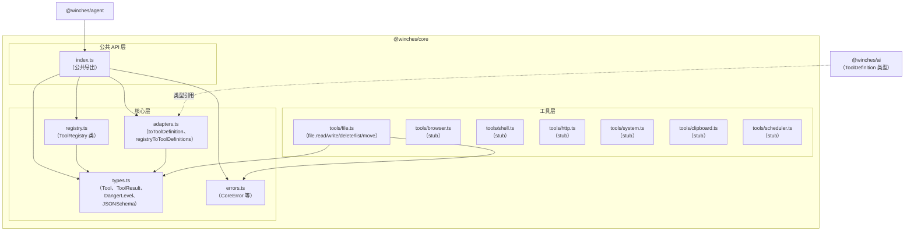
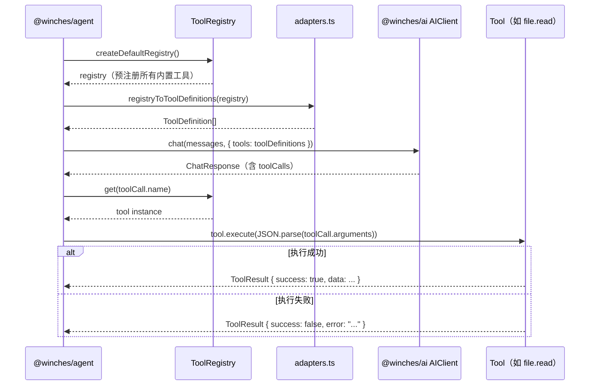
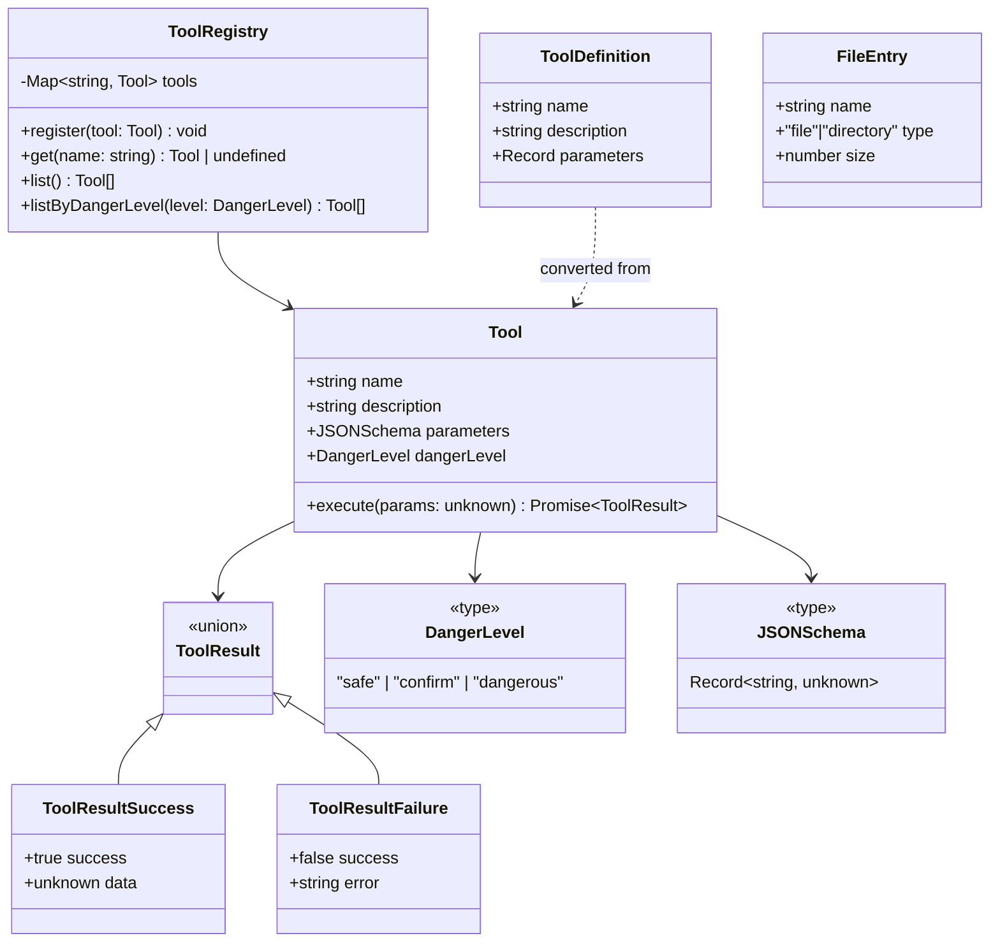

# 技术设计文档 — @winches/core 工具注册表与内置工具

## 概述

`@winches/core` 是 winches-agent monorepo 中的工具层，提供统一的工具接口规范、工具注册表和内置工具实现。该包的核心职责是定义 `Tool` 接口抽象，实现 `ToolRegistry` 注册中心，并提供文件操作等内置工具。工具定义格式与 `@winches/ai` 的 `ToolDefinition` 对齐，支持 LLM tool calling 无缝集成。

Phase 2 实施范围：工具注册表 + 文件操作工具（file.read、file.write、file.delete、file.list、file.move）。Phase 4 工具（browser/shell/http/system/clipboard/scheduler）以 stub 形式预留接口。

### 设计目标

- 统一抽象：通过 `Tool` 接口规范所有工具的结构，上层代码无需感知具体工具实现
- 权限分级：通过 `DangerLevel` 区分工具风险等级，支持 Agent 在执行前进行权限检查
- LLM 对齐：工具定义可直接转换为 `@winches/ai` 的 `ToolDefinition` 格式，零适配成本
- 可扩展：`ToolRegistry` 支持运行时注册自定义工具，`createDefaultRegistry` 提供开箱即用的默认配置
- 文件安全：文件操作工具使用 Node.js 内置 `fs/promises`，不引入额外依赖

### 设计决策

| 决策 | 选择 | 理由 |
|------|------|------|
| 工具执行参数类型 | `unknown`（运行时校验） | 工具参数来自 LLM JSON 输出，类型不可静态保证，需运行时校验 |
| ToolResult 设计 | 判别联合类型（success 字段区分） | 避免 throw/catch 模式，工具执行结果显式携带成功/失败状态 |
| 文件操作依赖 | Node.js 内置 `fs/promises` | 无需额外依赖，减小包体积 |
| Phase 4 工具处理 | stub 文件预留接口，不实现逻辑 | 保持接口稳定性，避免未来破坏性变更 |
| 日志 | pino | 与 monorepo 统一日志方案一致 |
| 错误处理 | 工具内部捕获异常，返回 ToolResult | 工具执行失败不应抛出异常，由调用方根据 ToolResult 决策 |

## 架构

### 整体架构图



### 调用流程



## 组件与接口

### 1. 核心类型（types.ts）

```typescript
/** 工具权限级别 */
type DangerLevel = "safe" | "confirm" | "dangerous";

/** JSON Schema 对象（与 @winches/ai ToolDefinition.parameters 兼容） */
type JSONSchema = Record<string, unknown>;

/** 工具接口 */
interface Tool {
  name: string;
  description: string;
  parameters: JSONSchema;
  dangerLevel: DangerLevel;
  execute(params: unknown): Promise<ToolResult>;
}

/** 工具执行结果（判别联合类型） */
type ToolResult =
  | { success: true; data: unknown }
  | { success: false; error: string };
```

### 2. ToolRegistry — 工具注册中心（registry.ts）

```typescript
class ToolRegistry {
  private tools: Map<string, Tool>;

  /** 注册工具；若名称已存在则抛出 DuplicateToolError */
  register(tool: Tool): void;

  /** 获取工具；未注册返回 undefined */
  get(name: string): Tool | undefined;

  /** 返回所有已注册工具的数组 */
  list(): Tool[];

  /** 返回指定权限级别的工具数组 */
  listByDangerLevel(level: DangerLevel): Tool[];
}

/** 工厂函数：返回预注册所有内置工具的 ToolRegistry 实例 */
function createDefaultRegistry(): ToolRegistry;
```

### 3. 适配器函数（adapters.ts）

```typescript
import type { ToolDefinition } from "@winches/ai";

/** 将单个 Tool 转换为 @winches/ai ToolDefinition 格式 */
function toToolDefinition(tool: Tool): ToolDefinition;

/** 将 ToolRegistry 中所有工具批量转换为 ToolDefinition 数组 */
function registryToToolDefinitions(registry: ToolRegistry): ToolDefinition[];
```

### 4. 文件操作工具（tools/file.ts）

```typescript
/** file.read — 读取文件内容（safe） */
const fileReadTool: Tool = {
  name: "file.read",
  description: "读取指定路径的文件内容",
  dangerLevel: "safe",
  parameters: {
    type: "object",
    properties: {
      filePath: { type: "string", description: "文件路径" },
      encoding: { type: "string", description: "文件编码，默认 utf-8" },
    },
    required: ["filePath"],
  },
  execute(params: unknown): Promise<ToolResult>,
};

/** file.write — 写入文件（confirm） */
const fileWriteTool: Tool = {
  name: "file.write",
  description: "将内容写入指定路径的文件，目录不存在时自动创建",
  dangerLevel: "confirm",
  parameters: {
    type: "object",
    properties: {
      filePath: { type: "string", description: "目标文件路径" },
      content: { type: "string", description: "写入内容" },
    },
    required: ["filePath", "content"],
  },
  execute(params: unknown): Promise<ToolResult>,
};

/** file.delete — 删除文件（dangerous） */
const fileDeleteTool: Tool = {
  name: "file.delete",
  description: "删除指定路径的文件",
  dangerLevel: "dangerous",
  parameters: {
    type: "object",
    properties: {
      filePath: { type: "string", description: "要删除的文件路径" },
    },
    required: ["filePath"],
  },
  execute(params: unknown): Promise<ToolResult>,
};

/** file.list — 列出目录内容（safe） */
const fileListTool: Tool = {
  name: "file.list",
  description: "列出指定目录下的文件和子目录",
  dangerLevel: "safe",
  parameters: {
    type: "object",
    properties: {
      dirPath: { type: "string", description: "目录路径" },
      recursive: { type: "boolean", description: "是否递归列出子目录，默认 false" },
    },
    required: ["dirPath"],
  },
  execute(params: unknown): Promise<ToolResult>,
};

/** file.move — 移动或重命名文件（confirm） */
const fileMoveTool: Tool = {
  name: "file.move",
  description: "将文件从源路径移动到目标路径，目标目录不存在时自动创建",
  dangerLevel: "confirm",
  parameters: {
    type: "object",
    properties: {
      sourcePath: { type: "string", description: "源文件路径" },
      destPath: { type: "string", description: "目标文件路径" },
    },
    required: ["sourcePath", "destPath"],
  },
  execute(params: unknown): Promise<ToolResult>,
};
```

### 5. Phase 4 工具 Stub（tools/browser.ts 等）

每个 Phase 4 工具文件导出一个 `Tool[]` 数组，`execute` 方法返回 `{ success: false, error: "Not implemented" }`，供 `createDefaultRegistry` 注册时使用。

```typescript
// tools/browser.ts 示例
export const browserTools: Tool[] = [
  {
    name: "browser.open",
    description: "在受控浏览器中打开指定 URL",
    dangerLevel: "safe",
    parameters: { type: "object", properties: { url: { type: "string" } }, required: ["url"] },
    async execute(_params: unknown): Promise<ToolResult> {
      return { success: false, error: "Not implemented (Phase 4)" };
    },
  },
  // browser.screenshot, browser.click, browser.type, browser.evaluate, browser.navigate
];
```

### 6. 错误类型（errors.ts）

```typescript
/** 基础 Core 包错误 */
class CoreError extends Error {
  constructor(message: string, options?: { cause?: unknown });
}

/** 工具名称重复注册错误 */
class DuplicateToolError extends CoreError {
  public readonly toolName: string;
  constructor(toolName: string);
}

/** 工具参数校验错误 */
class ToolParamError extends CoreError {
  public readonly toolName: string;
  constructor(toolName: string, message: string);
}
```

## 数据模型

### 核心类型定义

```typescript
// ===== 工具接口 =====

type DangerLevel = "safe" | "confirm" | "dangerous";

type JSONSchema = Record<string, unknown>;

interface Tool {
  name: string;
  description: string;
  parameters: JSONSchema;
  dangerLevel: DangerLevel;
  execute(params: unknown): Promise<ToolResult>;
}

type ToolResult =
  | { success: true; data: unknown }
  | { success: false; error: string };

// ===== 文件列表条目 =====

interface FileEntry {
  name: string;
  type: "file" | "directory";
  size: number; // 字节数
}

// ===== 适配器输出（来自 @winches/ai） =====

interface ToolDefinition {
  name: string;
  description: string;
  parameters: Record<string, unknown>;
}
```

### 类型关系图



### 文件结构

```
packages/core/src/
├── index.ts              # 公共 API 导出
├── types.ts              # Tool、ToolResult、DangerLevel、JSONSchema、FileEntry
├── registry.ts           # ToolRegistry 类、createDefaultRegistry
├── adapters.ts           # toToolDefinition、registryToToolDefinitions
├── errors.ts             # CoreError、DuplicateToolError、ToolParamError
└── tools/
    ├── file.ts           # 文件操作工具（Phase 2）
    ├── browser.ts        # 浏览器工具（Phase 4，stub）
    ├── shell.ts          # Shell 工具（Phase 4，stub）
    ├── http.ts           # HTTP 工具（Phase 4，stub）
    ├── system.ts         # 系统信息工具（Phase 4，stub）
    ├── clipboard.ts      # 剪贴板工具（Phase 4，stub）
    └── scheduler.ts      # 定时任务工具（Phase 4，stub）
```


## 正确性属性（Correctness Properties）

*属性（Property）是指在系统所有合法执行中都应成立的特征或行为——本质上是对系统应做什么的形式化陈述。属性是人类可读规格说明与机器可验证正确性保证之间的桥梁。*

### Property 1: 工具 execute 返回合法 ToolResult 结构

*For any* 内置工具和任意参数输入，调用 `execute` 方法的返回值应是合法的 `ToolResult` 结构：包含 `success` 布尔字段；当 `success` 为 `true` 时包含 `data` 字段；当 `success` 为 `false` 时包含 `string` 类型的 `error` 字段。

**Validates: Requirements 1.2, 1.3**

### Property 2: 所有已注册工具的 dangerLevel 合法

*For any* `ToolRegistry` 实例，`list()` 返回的所有工具的 `dangerLevel` 字段值应属于 `"safe"`、`"confirm"`、`"dangerous"` 三者之一。

**Validates: Requirements 1.4**

### Property 3: 工具注册 round-trip

*For any* `Tool` 实例，将其注册到 `ToolRegistry` 后，以 `tool.name` 为参数调用 `get` 应返回同一个工具实例。

**Validates: Requirements 2.2, 2.4**

### Property 4: 重复注册抛出包含工具名称的错误

*For any* 工具名称，将同名工具注册两次时，第二次 `register` 调用应抛出错误，且错误消息中应包含该工具名称。

**Validates: Requirements 2.3**

### Property 5: 未注册工具查询返回 undefined

*For any* 未在 `ToolRegistry` 中注册的字符串名称，调用 `get` 应返回 `undefined`。

**Validates: Requirements 2.5**

### Property 6: list 返回所有已注册工具

*For any* 一组工具，将它们全部注册到 `ToolRegistry` 后，`list()` 返回的数组长度应等于注册工具数量，且包含所有已注册工具。

**Validates: Requirements 2.6**

### Property 7: listByDangerLevel 过滤正确性

*For any* `ToolRegistry` 和任意 `DangerLevel` 值，`listByDangerLevel(level)` 返回的所有工具的 `dangerLevel` 应等于传入的 `level`，且不遗漏任何匹配该级别的已注册工具。

**Validates: Requirements 2.7**

### Property 8: toToolDefinition 字段映射保留语义

*For any* `Tool` 实例，`toToolDefinition(tool)` 的结果中，`name` 应等于 `tool.name`，`description` 应等于 `tool.description`，`parameters` 应等于 `tool.parameters`。

**Validates: Requirements 3.2**

### Property 9: registryToToolDefinitions 批量转换完整性

*For any* `ToolRegistry`，`registryToToolDefinitions(registry)` 返回的数组长度应等于 `registry.list()` 的长度，且每个元素应与对应工具的 `toToolDefinition` 结果一致。

**Validates: Requirements 3.3**

### Property 10: file.write / file.read round-trip

*For any* 合法文件路径和任意字符串内容，调用 `file.write` 写入后再调用 `file.read` 读取，应返回 `success: true` 且 `data` 等于原始写入内容。

**Validates: Requirements 4.2, 5.2**

### Property 11: 文件操作对不存在路径返回描述性错误

*For any* 不存在的文件路径，调用 `file.read`、`file.delete` 或 `file.list`（传入不存在路径）应返回 `success: false` 且 `error` 字符串中包含该路径信息。

**Validates: Requirements 4.4, 6.3, 7.4, 8.4**

### Property 12: file.delete 删除后文件不可读

*For any* 已存在的文件，调用 `file.delete` 成功后，再调用 `file.read` 读取同一路径应返回 `success: false`（文件已不存在）。

**Validates: Requirements 6.2**

### Property 13: file.move 移动后源不存在、目标内容一致

*For any* 已存在的文件和合法目标路径，调用 `file.move` 成功后，读取源路径应返回 `success: false`，读取目标路径应返回 `success: true` 且内容与移动前一致。

**Validates: Requirements 8.2**

### Property 14: file.list 条目结构完整性

*For any* 存在的目录，`file.list` 返回的每个条目应包含 `name`（string）、`type`（`"file"` 或 `"directory"`）和 `size`（number）字段。

**Validates: Requirements 7.2**

## 错误处理

### 错误类型层次

```typescript
/** 基础 Core 包错误 */
class CoreError extends Error {
  constructor(message: string, options?: { cause?: unknown }) {
    super(message, options);
    this.name = "CoreError";
  }
}

/** 工具名称重复注册错误 */
class DuplicateToolError extends CoreError {
  public readonly toolName: string;
  constructor(toolName: string) {
    super(`Tool "${toolName}" is already registered`);
    this.name = "DuplicateToolError";
    this.toolName = toolName;
  }
}

/** 工具参数校验错误（工具内部使用，不对外抛出） */
class ToolParamError extends CoreError {
  public readonly toolName: string;
  constructor(toolName: string, message: string) {
    super(`[${toolName}] Invalid params: ${message}`);
    this.name = "ToolParamError";
    this.toolName = toolName;
  }
}
```

### 错误处理策略

| 场景 | 错误类型 | 处理策略 |
|------|----------|----------|
| 重复注册工具名称 | DuplicateToolError | 立即抛出，包含工具名称 |
| 工具参数类型不合法 | ToolResult { success: false } | 工具内部捕获，返回 ToolResult 而非抛出 |
| 文件不存在 | ToolResult { success: false } | 捕获 ENOENT，返回包含路径的错误消息 |
| 文件权限不足 | ToolResult { success: false } | 捕获 EACCES/EPERM，返回包含错误描述的消息 |
| 目录不存在（写入/移动时） | 自动创建 | 调用 `fs.mkdir({ recursive: true })` 后继续操作 |
| Phase 4 工具调用 | ToolResult { success: false } | 返回 "Not implemented (Phase 4)" 错误消息 |
| 未知文件系统错误 | ToolResult { success: false } | 捕获所有异常，返回 error.message |

### 日志策略

使用 pino 进行结构化日志记录：

- `debug`：工具执行开始（包含工具名称和参数摘要，不含敏感路径内容）
- `info`：`createDefaultRegistry` 初始化完成（包含注册工具数量）
- `warn`：文件操作遇到可恢复错误（如文件不存在）
- `error`：意外的文件系统错误（非预期的错误码）

## 测试策略

### 双重测试方法

本包采用单元测试 + 属性测试的双重测试策略：

- **单元测试**：验证具体示例、边界情况和错误条件
- **属性测试**：验证跨所有输入的通用属性

两者互补，缺一不可。

### 测试框架

- **单元测试**：Vitest
- **属性测试**：fast-check（TypeScript 生态最成熟的属性测试库）
- **配置**：每个属性测试最少运行 100 次迭代

### 单元测试范围

单元测试聚焦于：

- 所有内置工具的元数据验证（name、dangerLevel 字段值）
- `createDefaultRegistry` 返回包含所有预期工具名称的注册表
- `toToolDefinition` 和 `registryToToolDefinitions` 的具体转换示例
- 边界情况：空目录列表、文件路径含特殊字符、写入空字符串
- 错误条件：重复注册同名工具、读取不存在文件、删除不存在文件
- Phase 4 stub 工具返回 "Not implemented" 错误

### 属性测试范围

每个属性测试对应设计文档中的一个正确性属性，使用 fast-check 生成随机输入：

- **Property 1**：生成随机参数，验证所有内置工具 execute 返回合法 ToolResult 结构
  - Tag: `Feature: winches-core, Property 1: 工具 execute 返回合法 ToolResult 结构`
- **Property 2**：验证所有已注册工具的 dangerLevel 合法
  - Tag: `Feature: winches-core, Property 2: 所有已注册工具的 dangerLevel 合法`
- **Property 3**：生成随机 Tool 实例，验证注册后 get 返回同一实例
  - Tag: `Feature: winches-core, Property 3: 工具注册 round-trip`
- **Property 4**：生成随机工具名称，验证重复注册抛出包含名称的错误
  - Tag: `Feature: winches-core, Property 4: 重复注册抛出包含工具名称的错误`
- **Property 5**：生成随机未注册名称，验证 get 返回 undefined
  - Tag: `Feature: winches-core, Property 5: 未注册工具查询返回 undefined`
- **Property 6**：生成随机工具集合，验证 list 返回所有已注册工具
  - Tag: `Feature: winches-core, Property 6: list 返回所有已注册工具`
- **Property 7**：生成随机工具集合和 DangerLevel，验证 listByDangerLevel 过滤正确
  - Tag: `Feature: winches-core, Property 7: listByDangerLevel 过滤正确性`
- **Property 8**：生成随机 Tool 实例，验证 toToolDefinition 字段映射
  - Tag: `Feature: winches-core, Property 8: toToolDefinition 字段映射保留语义`
- **Property 9**：生成随机工具集合，验证 registryToToolDefinitions 批量转换完整性
  - Tag: `Feature: winches-core, Property 9: registryToToolDefinitions 批量转换完整性`
- **Property 10**：生成随机文件内容，验证 file.write/file.read round-trip（使用临时目录）
  - Tag: `Feature: winches-core, Property 10: file.write / file.read round-trip`
- **Property 11**：生成随机不存在路径，验证文件操作返回包含路径的错误
  - Tag: `Feature: winches-core, Property 11: 文件操作对不存在路径返回描述性错误`
- **Property 12**：生成随机文件内容，验证 file.delete 后 file.read 返回 success: false
  - Tag: `Feature: winches-core, Property 12: file.delete 删除后文件不可读`
- **Property 13**：生成随机文件内容和目标路径，验证 file.move 后源不存在目标内容一致
  - Tag: `Feature: winches-core, Property 13: file.move 移动后源不存在、目标内容一致`
- **Property 14**：生成随机目录结构，验证 file.list 条目结构完整性
  - Tag: `Feature: winches-core, Property 14: file.list 条目结构完整性`

### 测试文件结构

```
packages/core/src/
└── __tests__/
    ├── types.test.ts              # 类型导出验证（示例测试）
    ├── registry.test.ts           # ToolRegistry 单元测试 + 属性测试（Property 3-7）
    ├── adapters.test.ts           # 适配器函数单元测试 + 属性测试（Property 8-9）
    ├── errors.test.ts             # 错误类型单元测试
    └── tools/
        ├── file.test.ts           # 文件工具单元测试 + 属性测试（Property 1, 10-14）
        └── stubs.test.ts          # Phase 4 stub 工具验证
```

### Mock 策略

- 文件操作属性测试使用 Node.js `os.tmpdir()` 创建临时目录，测试后清理，不 mock `fs/promises`
- `ToolRegistry` 和适配器测试使用内存中的 mock Tool 对象，无需文件系统
- pino 日志在测试中通过 `pino({ level: 'silent' })` 静默，不影响测试输出
